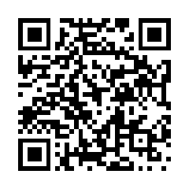

**如何看特朗普靠迷因币获利**

1\. 蠢人和他的钱很快就会分开。

2\. 如果你从一个申请过六次破产的人手里买了魔豆，那也算是自找的。

3\. 这不全是蠢人的钱；跟在他身后的那些人没有几十亿美元。这是企业和外国实体直接给他的贿赂。

4\. 如果这是2016年，你还年轻、每天看屏幕时间太长，没法理解算法时代，那我会替你难过。但如果你看见这个人冲击国会大厦、把自己的蠢货送进监狱和坟墓，还看见他在把整个政府握在手里时都拿不出任何选举舞弊证据，却仍然想把毕生积蓄送给他，那就太可笑了。

5\. 他们不是蠢人，而是在送钱行贿。想要赦免？行情是“买”100万美元他的迷因币。真正的蠢人，是那些以为这只是单纯犯傻的人。

6\. 我为什么对那些被特朗普骗的人几乎没有同情？因为他们被坑了之后还在支持他。

7\. 谁真的买了这些币？是普通的乔·舒默，还是他们只是用来洗贿赂的工具，而买家本来就预期会被抛售？

8\. 你的朋友被炉子烫伤了，你会觉得难过，给他药膏并包扎好。他马上拆掉绷带，再去摸炉子，烫得更严重。你会想：“你到底怎么了？”他却说自己没事，还让你再包扎一次。你虽然困惑，还是因为他受伤而帮忙。结果他又扯掉绷带，再次去摸炉子。你终于冲他大喊，问他为什么一直这么做。他一脸困惑，坚持说不是炉子烫了他，还把责任推给一个叫乔的人。

9\. 一名妻子曾在特朗普币推出后立刻发帖，说她丈夫把他们所有的钱都投进了这枚币，问怎样才能让他把剩下的钱取出来。他坚信价格会反弹、他们会发财。我会同情那些受到愚蠢决定影响的人。

10\. 我的想法是，特朗普是个毫无价值的恋童癖，而所有买这枚币的人都活该得到他们得到的结果。

11\. 加密迷因币是世界上最明显的拉高出货骗局。一个人要是上了当，那就是蠢，没别的说法。

12\. 我很震惊，大家都把特朗普币当成骗局。它不是骗局，而是一种行贿特朗普的方式。去年五月，特朗普举办黑领结晚宴，奖励前220名$TRUMP持有者；参加者在他的加密代币上投入了数百万美元，最大的25名投资者还获得了与总统进行小型贵宾会面的机会。你基本上就是把一大笔钱付给特朗普的公司，好去见特朗普，这是多绕了一道手续的贿赂。所以我看到的评论都在关注投资亏损、称它是骗局，却没人提到这种猖獗的腐败。

13\. 你是说，一个被判34项欺诈罪成立的人，居然实施了欺诈？！😱

14\. 特朗普一直都是骗子。

15\. 这是“我早就告诉过你了”的时刻。

16\. 骗子总会继续行骗。

17\. 你们被这个混蛋骗了很久。

18\. 你会以为，拿到特朗普大学的博士学位至少意味着有点智力。

19\. 真正的故事是：我们有一位公开在椭圆形办公室处理自己的商业事务、利用总统职位影响这些交易的总统，而媒体却坐在那里，表现得好像这一切都很正常。

20\. 我对他做的其他骗局也是同样的感觉：累了。大多数美国人已经用他们的第二修正案明确表示，他们接受现任政府、他的科技富豪伙伴、爱泼斯坦名单以及其他一切。我已经不在乎了，整个国家明天消失也无所谓，世界其他地方会继续当成年人。

21\. 特朗普。想法？滚。

22\. 虽然他和他那恶心的家人靠这个骗局发财确实令人恼火，但那些买入并亏钱的人我一点也不同情。他们都被告知这是骗局，却还是买了进去。

23\. 我认为他应该入狱，所有资产都应该被没收。

24\. 那些蠢货会跟着这个人下地狱。

25\. 我觉得这就是在众目睽睽之下洗行贿款。

26\. 迷因币大多不就是这样吗？这让我想起很久以前他把一家赌场上市的事：赌场每年给特朗普集团支付大约1000万美元“管理费”，而他尽快卖掉了自己在公司的股份。特朗普赚了数千万美元，股东却损失了95%以上。特朗普最喜欢的交易，就是别人把钱给他，他留下这些钱，自己几乎什么都不做，或者完全什么都不做。

27\. 一开始就去买特朗普迷因币，听起来是个极其糟糕的主意；如果你投资这种东西，差不多就是在自找亏钱。

28\. 任何还相信特朗普的人都是冤大头。

29\. 他们投票支持了这一切，也买了这枚币。这是他们自己的错。让他们泡在自己的惨状里吧。特朗普是个鬼怪、恋童癖和强奸犯，也是有史以来最腐败的人之一。

30\. 这至少已经是他们第四或第五次获得“又一次上当”的奖了。到现在还没看出规律，你的大脑一定出了严重问题。我的意思是，特朗普干得好，他找到了自己的目标人群——蠢货——并且正在做他最擅长的事：剥削他们。看着这一切简直令人着迷。

**为什么有人爱回复群发邮件说“大家早上好”？**

1\. 因为还没有人拿一条大鱼抽过他们。

2\. 或者是有人在 Teams 上发一句“嗨”，然后等你回复，去他妈的。

3\. 有个女人因为我没有及时回应 Teams 消息而向老板投诉，说：“我看到他明明马上就读了，却从来没回复。”老板说：“哦，抱歉。我把他叫进来。嘿，Ricer，我把 Cindy 带来了，她说你无视她的消息。”我说：“那条消息只写了‘嗨’，而且我正在忙。她有事就直接问。”然后老板当着我的面把她狠狠训了一顿，说她浪费了我们两个人的时间。

4\. 有人一上来写“早上好，Three3Jane”，我回“早，怎么了？”，然后对方就……没下文了。你主动来找我，说明你大概是有事，能不能别让我为了弄清楚你到底想干什么而把工作日搞得更难？我完全接受“早上好，Three3Jane，能把 ABC 客户的 XYZ 报告发给我吗？”这种说法，寒暄完马上说请求，规矩都遵守了。但如果你非要让我为了你想要的东西回复两次，那我还有别的事要做。

5\. 我直接不回。要么说重点，要么别说；既然我知道那个只发“嗨”的人接下来就是要给我的一天添屎，那我没时间应付这种没用的寒暄。

6\. 群发工作邮件是我们大多数人在工作中能得到的最有趣的娱乐。我在一家大公司工作，最近有人回复了全公司都收到的邮件。结果特别好笑：几百个人一边回复所有人，一边要求把自己从邮件列表里移除；几十个人一边回复所有人，一边训斥别人不要回复所有人；还有各种各样的蠢回复。邮件停止之前，我记得收件箱里的回复数量超过了 500 条。简直太精彩了。

7\. 我讨厌有人发邮件祝贺某个人，然后 800 个人回复所有人，也来亲自表示祝贺。他们为什么不在 Teams 上直接联系那个人，或者直接给那个人发邮件，我永远想不明白。

8\. 纯粹是为了表演，好让自己看起来积极又有干劲，希望被职位足够高的人注意到。这就是职场版的“请注意我，前辈”梗。

9\. 我每天大多数邮件都是“回复：庆祝某位员工工作 13 年”。每天都是。

10\. 如果大家学会群发邮件时使用密送，这个问题就不会存在了。

11\. 大家早上好。

12\. 缺乏社交和职业意识。

13\. 有人给全体员工发了一封语气过分严厉、像命令一样的群发邮件，问候语也非常疏远。一个讽刺的员工回复“早上好”，是想让发件人注意到自己缺乏礼貌，也想逗其他人笑。如果你和法国人一起工作过，就知道这种事可能发生，而且大家都会觉得很搞笑。

14\. 我曾见过一封公司范围内的邮件，点名感谢几个人促成了一笔大收购，结果一个随机的设施部门员工回复所有人说：“不客气！”他根本不在那几个人的名单里。有时还会有人劫持群发邮件，回复所有人去问某个人一件完全不相干的事情。办公室生活让我觉得，美国企业里大多数人简直是完全没脑子的白痴，根本不会正确处理邮件。

15\. 因为他们在工作之外没有朋友或社区。他们拼命寻求社区感和人与人的互动，即使这种互动并不受欢迎、也得不到回应，而回复群发邮件是最容易下手的机会。

16\. 有人把邮件发错了通讯组，100 个人回复所有人提醒他，接着又有 100 个人回复所有人，告诉大家别再按“回复所有人”。

17\. 因为发件人没有受过培训，不知道应该把自己放在收件人栏里，再用密送发给所有人。

18\. “把我从这个邮件线程里移除。”

19\. 他们就只写“大家早上好”？

20\. 为什么有人给几百个人群发邮件，却不使用密送？

21\. 我的老板是个彻头彻尾的邮件恐怖分子。

22\. 我喜欢这种事，简直就是混乱。我曾在一家大型国防承包商工作。有个星期五，一名保安觉得把一封邮件发给所有人，告诉大家他孙女在卖女童军饼干、可以下单，是个好主意。把这事发到 COMPANY_ALL 邮件列表已经够糟了，但接下来还有一大堆人回复所有人说“我为什么会收到这个？”“别发给我！”以及各种你能想到的抱怨。然后又有人回复所有人说“别回复所有人，你们要把邮件系统弄死了！”场面非常疯狂，而且邮件系统真的被弄瘫了。

23\. 这正是为什么你应该把自己放进“收件人”栏，把所有群发对象放进密送栏。

24\. 为了羞辱那些这么做的人。我最喜欢的情况是有人在涉及敏感信息时还这么干。

25\. 还有那些在会议结束后继续在 Teams 里回复“谢谢！”的人。烦死了。

26\. 不懂怎么用 Reddit 的人。

27\. 我第一份工作时，一群快退休的成年人每年都在群发邮件里争吵：有人要求不要回复，说这会打扰所有人，但他们自己又在回复。每年都这样。

28\. 我每天有 8 个小时要假装自己是一个亲企业的外向派……我就是用这种方式，让尽可能多的人看见自己亲企业、外向的一面。这只是表演的一部分。如果我发现另一个同事也在演，那就恭喜了：我们现在可以接触彼此的高级人格，成了可能会、也可能不会在工作之外见面的真正工作伙伴。

29\. 不受欢迎的看法：我其实喜欢这种邮件。它们让我想起屏幕另一边是真实的人，奇怪地说还会让我停下来喘口气。真正让我崩溃的是，两个人就一场我根本没参加的会议来回发了 10 封邮件，讨论谁在不在场，以及与我完全无关的信息；而我当时正忙着做类似的项目。我的大脑会立刻扫描邮件里有没有相关信息，然后才发现“等等，这根本不是发给我的”。相比之下，我更乐意看到随机的“大家早上好”邮件。不过我的团队也很随和，所以我确实很喜欢它们。

30\. 这点数量算什么？我们机构有些地区邮件列表里有一万两千多人。大约每年一次，会有人给这 12,000 多人发一封蠢邮件，其中大约十分之一的人会回复所有人。然后他们再回复所有人，再来一次，再来一次……

**十年前的炫耀性消费，如今为何显得俗气？**

1\. 再过十年，答案会是巨大尺寸的白色烤瓷贴面牙。天啊，赶紧让这一切停下来吧。

2\. 去土耳其做贴面的人有多少最后回家时变成了全口牙冠，真是疯狂。原本健康、完全没问题的牙齿，就这样被磨成了像《魔戒》里咕噜那样的牙。

3\. 我姐姐刚做了那种牙，我现在叫她 Uncle Baby Billy。

4\. Hummer。当时想说它，却突然意识到那已经更接近二十年前了。于是立刻套上《拯救大兵瑞恩》的表情包。

5\. Cybertruck 就是新的 Hummer。

6\. H2 放到现在的路上，跟大多数车比起来居然显得很小。我也不知道这是怎么发生的；当年我们还狠狠嘲笑那些开这种车的蠢货。

7\. Supreme、Beats 和 Yeezys 之类的东西。2016 年竟然已经是十年前了……天啊，我打字时把自己也伤到了。

8\. Beats 的工程故事一直让我觉得很好笑。它们最初被认为太轻，所以不像做工好；于是厂家故意塞进了一些纯粹用来增加重量的东西，让人拿在手里觉得更重，也就觉得做工更好。

9\. NFT。虽然还不到十年前，但这绝对当之无愧。

10\. 我发誓，你们这些书呆子谁都别对我的新 Brexit 纹身说三道四。

11\. 当时在我这个年龄层里，Supreme 和所有潮流品牌的东西本来就很俗，也很浪费钱，只不过至少那时候确实如此。

12\. 每个房间都挂着那种米灰色的装饰，以及整套 Modern Farmhouse 风格的房子。它们大约五年前达到顶峰，幸好现在正在迅速过时。整套假装自给自足的田园生活潮流正在消亡，谢天谢地。

13\. 每个房间都挂着草写字体的装饰牌。

14\. 懂很多加密货币知识。

15\. 超大钻戒的潮流。钻石一旦达到五克拉以上，看起来就像鸡尾酒戒指，特别浮夸。

16\. 3D 电视肯定也得算一个。

17\. 我住的地方，有一个人装了户外壁炉，所有人都觉得很厉害；然后镇上的其他男人一个接一个也开始装。起初没什么问题，直到有个人装了一个更大的，大家就都想去他家。接下来，不同的人开始装越来越大的户外壁炉。最后，一个没人喜欢的家伙 Greg 装了一个巨大到人可以站进去的壁炉。他不停烧掉一大堆木头，还说“Hot time”和“It's getting warm in here”，不断给大家发自己院子的照片。我不知道他到底烧了多少木头。

18\. Kylie 的唇釉套装，或者 Anastasia 的眉粉。

19\. 希望以后性别揭晓派对也会被这样回头看待。

20\. 几乎所有人都在当或试图当网红。以后这会像千禧一代回头看自己那些标题是奇怪歌词的 Facebook 相册一样：一边尴尬，一边迅速把整套相册删掉。我等不及想看这些网红意识到自己的内容有多尴尬，然后集体删除。

21\. 我第一反应是 Blackberry，后来才意识到那已经更接近二十年前了。然后我变成了骨架，接着化成灰，现在正随风飘散。

22\. 给它一点时间，丰唇也会沦落到这个地步。现在已经开始了。“Mar-a-Lago 脸”已经有了明确的定义。

23\. Louis Vuitton。我总觉得那些人是在太用力地表现自己很有钱。

24\. 喷成金色的墙面装饰和其他装饰物。

25\. 也许只是因为那时我还在上小学，所以感受更明显，但一部全新的 iPhone 确实算。十年前 iPhone 大概正处在巅峰。我觉得 Apple 最后一部受 Jony Ive 影响的手机是 2017 年的 X。现在我只会看到人们一部手机用好几年，因为新旧款之间没什么变化。

26\. 去参加 Burning Man。

27\. Twitter 认证。

28\. 伸缩加长豪华轿车。除了葬礼，我已经有二十多年没见过它了。事实上，如果你看《继承之战》，他们几乎总是坐各种豪车，却很少坐这种轿车。它们显然已经失去地位了。

29\. 睫毛嫁接。我认识的人每月花 250 美元做嫁接和补接，而且效果还是暂时的。现在仍然做的人很少了，当时那种娃娃一样的风格如今被认为很俗。

30\. 任何带巨大 Logo 的东西，比如 Vuitton、Chanel 等。

<section style="margin:24px 0 0;padding:16px 18px;background:#f7f7f7;border-radius:6px;">
<table style="width:100%;min-width:0;margin:0;border-collapse:collapse;">
<tbody><tr>
<td style="border:none;padding:0;vertical-align:middle;">

长按识别二维码，查看更多每日精选

https://blog.bhwa233.com/

</td>
<td style="border:none;width:96px;padding:0 0 0 14px;vertical-align:middle;">

</td>
</tr></tbody></table>
</section>
