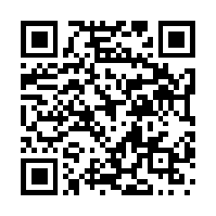

## 如何看待奥索夫痛斥特朗普为“逃兵役者、骗子总统”？

1\. 这一批评完全符合事实，甚至显得过于克制和温和。早在2015年乃至上世纪90年代，关于其借骨刺借口逃避越战兵役以及借助总统职权谋取巨额商业利益的说法就已被广泛认知。批评者认为这一指控只是冰山一角，远未涵盖更严重的性侵、恋童、叛国与腐败指控；如果这些属于虚假诽谤，对方完全可以通过法律途径起诉，但并未发生。

2\. 民主党长期以来的应对过于软弱，应当放弃温和姿态采取更具攻击性的策略。面对政治对手，直接针对外貌特征、虚荣心以及与争议案件（如爱泼斯坦案）的关联展开高频攻击往往更能击中要害，建制派传统的温吞指责已难以有效撼动现有的政治格局。

3\. 现年三十多岁的佐治亚州民主党参议员奥索夫展现出了年轻一代政治家的演讲能力与务实风格，被不少人视为2028年大选的潜在有力人选。选民迫切希望由35至45岁、真正理解当代生活现状的新生代取代年迈的传统政客，且奥索夫在选区的选民服务工作也为其赢得了部分跨党派认可。

4\. 针对逃避越战兵役本身的道德定性存在分歧。拒绝参与越南战争在道德层面被部分人视为合理选择，真正引发反感的是依靠富家子弟特权和虚假医疗证明逃避兵役，而将此类历史旧账作为当下政治攻击的核心切入点实际收效甚微。

5\. 此类在特定社区引发热议的提问本质上属于迎合群体情绪的偏向性讨论。平台内的立场倾向极度单一，提问并未带来实质性的辩论空间，更多只是对已知立场的重复宣泄与附和。

## 哪些所谓的“低技能”工作，上一天班就会让人认清现实？

1\. 许多人认为“无门槛工作”（unskilled job）只代表不需要正规学历或长期专业培训，几分钟到几天就能学会基本流程，但这绝不意味着工作轻松。相反，这类岗位往往伴随着极端的体力消耗、心理压力或恶劣的作业环境，本质上是用工方压低薪酬的托词。

2\. 零售与客服岗位对人的心理消耗极大。服务人员每天要承受无休止的挑剔与无理指责，却没有回击的权力。许多经历过零售的人认为，只要全社会有半年强制的客服经历，人与人之间的同理心就会大幅提升。与这类岗位打交道时，只要态度平和、理解对方的权限限制，事情往往更容易办成，但现实中总有顾客将服务人员当作发泄情绪或贪小便宜的对象。

3\. 无论是水管工的挖沟助手还是电工学徒，纯粹的重体力挖掘工作会迅速击垮体力不足的人。例如在林间操作手推式开沟机，如同徒手拉扯一头暴怒的熊，即便只干一天也会带来前所未有的力竭感；长期在严寒或酷暑下挥锹作业的人，往往会对日常琐事产生极高的耐受度。

4\. 农场搬运干草捆是极度高强度的体力劳动。每捆草重约 50 磅（约 23 公斤），一天需要徒手装车、卸车并堆叠 50 到 250 捆。在超过 35 摄氏度的高温与极高湿度下，干草碎屑和粉尘会钻进衣服、鼻孔甚至皮肤，带来严重的刺痛感与过敏反应，若不戴手套作业双手会迅速受伤。

5\. 田间采摘水果和蔬菜需要极高的耐力和熟练度。普通人即使身体素质出众，在烈日下采摘一两个小时就会濒临虚脱，效率可能只有熟练工的十分之一。那些看似简单的重复动作，背后往往是长年累月磨炼出的效率与技巧。

6\. 餐厅洗碗工看似无需经验，但在用餐高峰期，堆积如山的餐具和锅具会迅速压垮新手。洗碗间常年处于高温、潮湿的环境，长时间接触水会导致皮肤开裂。洗碗工通常也是全餐厅最晚下班的人，必须等后厨所有厨具收拢完毕后才能完成最终清理，一旦洗碗环节停摆，整间餐厅的运转在二十分钟内就会彻底瘫痪。

7\. 养老院与医疗护理工作伴随着巨大的身体与心理负担。护理员不仅要处理排泄物、体液，协助失能老人或患者翻身清洁，还经常面临暴力攻击、言语侮辱或性骚扰。更沉重的是在与被照护者建立感情后面对生老病死的心理折磨，而这类岗位的薪资待遇往往与普通快餐店持平。

8\. 周日教会散场后的餐厅服务员与收银员往往要面对最苛刻的客流。大批顾客在用餐时态度傲慢，不仅频繁提出苛刻要求、要求分单，而且往往只给极少的小费，甚至用宗教宣传折页或画十字代替小费。

9\. 医院保洁不仅需要极强的体力，还必须严格遵守感染控制标准。保洁人员需要直面各种体液和高危污染源，在夜班人手极度短缺的情况下，少数几个人往往要负责整座大楼的消杀与清洁，一旦出现纰漏就会带来严重的院感风险。

10\. 工地杂工与重体力搬运充满恶劣的环境考验。例如在夏季高温且未安装空调的毛坯房中搬运厚重的石膏板，室内空气如同烤箱，工人每天需要饮用大量水分却因剧烈出汗无需排尿；搬家工人在没有电梯的多层公寓爬楼搬运重物，许多自诩经常健身的人往往支撑不过半天就会体力崩溃。

11\. 垃圾车随车装卸员需要在车辆以每小时三四十英里的速度行进时紧抓车身，在极短的停顿时间内频繁搬运重型垃圾桶并迅速归位。新人在酷暑和颠簸中往往坚持不了几小时就会因体力透支和失衡危险而放弃。

12\. 节假日或高峰期的快递配送与流水线作业对体力和节奏有极致要求。快递员天未亮就要装满几百件包裹，为了赶在天黑前送完往往连午饭都无法顾及；工厂流水线则要求工人必须跟上机械的绝对节奏，在噪音、安全隐患与重复动作的重压下，哪怕完成一个八小时班次也是极大的挑战。

## 谁是过气后心态最酸、最怨气冲天的明星？

1\. Chevy Chase 被广泛认为是这类名人的典型代表。他几十年来始终保持着居高临下的特权心态，自以为幽默实则待人刻薄，在业内几乎无人愿意与他共事。在《周六夜现场》50周年特别节目未获得核心展示后他表现得极为愤怒，甚至连早年的合作搭档都不愿为他辩护；他在行业内部恶名远扬，此前针对他的吐槽大会甚至罕见地几乎没有有分量的同行出席。

2\. Ellen DeGeneres 在公众形象崩塌后试图维持影响力的举动引发了大量反感。她在洛杉矶餐饮服务业早已以对待服务人员极其恶劣而闻名，随着 Dakota Johnson 在访谈中的直接反驳撕开假象，外界回看其往期脱口秀节目时，发现她对待嘉宾始终充斥着高人一等的优越感与刻薄。

3\. KISS 乐队的 Gene Simmons 因极度自恋且只看重金钱利益而备受诟病。同行在播客中试图探讨其音乐的艺术价值，却发现他除了商业变现外对作品本身毫无敬意；他的傲慢与恶劣态度甚至让多位资深主流媒体主持人都罕见地打破中立公开批评。

4\. 凭借《超级坏》成名的 Jonah Hill 虽然转型出演了《点球成金》和《华尔街之狼》等严肃作品，但在前女友公开其充满控制欲与精神操控的聊天记录后，其私下极度不安全感和恶劣行径被彻底曝光，打破了外界对其建立的专业滤镜。

5\. Steven Seagal 伴随着家暴、性骚扰、指控缠身以及片场极其懒惰的名声，在问答互动中遭到了全网声讨；不过也有观点指出，他更多是沉浸在脱离现实的自我幻想之中，甚至已经超越了单纯的酸楚与不甘。

6\. 包括 Kevin Sorbo、Dean Cain 和 Rob Schneider 在内的一批过气明星，倾向于将自己失去演出机会归咎于政治立场遭到排挤，实则是自身才华有限。Rob Schneider 早期完全依赖 Adam Sandler 的提携走红，脱口秀演出曾因效果太差被叫停，如今只能靠代言打着反政治正确旗号的贴牌威士忌和网络煽动言论博取关注。

7\. 《舞蹈妈妈》节目的导师 Abby Lee Miller 以对待儿童的羞辱式教育和官司缠身闻名。她在面对严苛的财务丑闻质询时反应激烈，并在访谈中不断将自己的压力归咎于制作团队，对当年受其吼叫与羞辱的孩子却毫无反思与歉意。

8\. Scottie Pippen 在退役后对“历史最佳球员”的评价标准频繁反复，完全取决于当时对 Michael Jordan 的个人情绪。尽管其职业生涯总薪水并不低且乔丹在名人堂演讲中首位向其致谢，但他始终活在作为二当家的阴影与当年低价长约的遗憾中，展现出难以释怀的怨怼。

9\. Mickey Rourke 经历拳击伤病与多次整容后容貌大变，为了重获关注参加英国真人秀节目，却因发表极具攻击性和仇恨色彩的言论被节目组直接驱逐，彻底从昔日的银幕偶像沦为脱节且刻薄的负面典型。

10\. Megadeth 乐队的 Dave Mustaine 虽然在被 Metallica 开除后建立了极为成功的乐队，但四十多年来依然将当年的解雇归咎于外部不公，始终无法正视自身当年导致被逐的行为，难以放下过去的执念。

11\. 经典情景剧《梦幻之岛》中饰演 Ginger 的 Tina Louise，因当年被承诺为绝对主角而放弃了进军大银幕的机会，角色深入人心后彻底限制了戏路。她终其一生都在极力抗拒这一代表作的标签并拒绝重聚活动，至今在面对相关采访时仍充满抗拒与怨气。

12\. Pauly Shore 始终无法理解自己为何失去热度，在未经当事人许可的情况下强行制作并发布了关于 Richard Simmons 的传记短片，沉溺于昔日光环而无法认清当下的现实。

**今天还有这些热帖**

4\. 有哪些看似毫不费力、自己一试才知极难的技能？

5\. 如果你明天醒来发现自己回到1990年且兜里有500美元，你会买什么？

6\. 你为什么会和看似完美的伴侣分手？

7\. 不让做意面、塔可和汉堡，两磅碎牛肉能做什么应急快餐？

8\. 40岁以上的人，有哪些你后悔没有更早开始做的事？

9\. 经验丰富的老司机有哪些避免事故的驾驶习惯或原则？

10\. 随着年龄增长，你越来越反感什么？

11\. 你在互联网上探索过最可怕的兔子洞是什么？

12\. 不考虑价格，你闻过最好闻的女士香水是什么？

13\. 教师们，学生对你说过最毛骨悚然的话是什么？

14\. 醉酒后不小心向男友吐露了真实心意

15\. 如果成吉思汗说他是上天派来惩罚你的，你会如何回怼？

16\. 曾经能用一辈子的耐用大牌，如今为何沦为劣质品？

17\. 约会时意外让对方误以为被恶意追踪

18\. 特朗普第二任期非法所得资产是否应被没收并用于冲抵国债

19\. 音乐史上哪些歌曲的前三秒最具辨识度？

20\. 从大学毕业生手里买二手电脑，对方竟然没格式化硬盘

21\. 有哪些安静的小爱好彻底改变了你的心理健康？

22\. 暗中买下父亲网店积压的六十条手工皮带，如今该如何处理？

23\. 吸引男性最有效的方式是什么？

24\. 优秀神剧中最烂的一集是哪一集？

25\. 一次吃光一整罐酸黄瓜，我后悔莫及

26\. 有哪些电视剧已经过了巅峰期、早就该完结了？

27\. 被伴侣出轨后，你发生了哪些改变？

28\. 野外用树叶当卫生纸导致感染

29\. 哪一集电视剧堪称满分神作？

30\. 旅行时你总会带哪些大多数人可能会漏掉的少见物品？

<section style="margin:24px 0 0;padding:16px 18px;background:#f7f7f7;border-radius:6px;">
<table style="width:100%;min-width:0;margin:0;border-collapse:collapse;">
<tbody><tr>
<td style="border:none;padding:0;vertical-align:middle;">

长按识别二维码，在博客看全部 30 个热帖

https://blog.bhwa233.com/posts/reddit-2026-08-19-life/

</td>
<td style="border:none;width:96px;padding:0 0 0 14px;vertical-align:middle;">

</td>
</tr></tbody></table>
</section>
