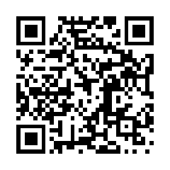

## Reddit 上的失业网友们，现在的就业市场到底有多难？

1\. 用别人的手机给自己的手机打电话，只为了确认它是不是真的还能响——这就是我目前的求职现状。甚至有父亲问孩子是不是在网上发过什么言论被行业彻底拉黑了；好不容易接到非营利机构电话说“岗位绝对想要你”，下一句却是“但得等我们拉到赞助”；各大招聘平台上更是充斥着虚假职位和骗局，很多岗位挂了半年以上根本不招人。

2\. 失业一个月，终于拿到了一家乳业公司的黄油生产机器操作员岗位，时薪 29.5 美元。这个薪资甚至高过了不少拥有硕士学位、在波士顿做 IT 或做专职技术员的人。更关键的是，工厂愿意给新人提供带薪培训，不像那些招聘写着初级岗、结果要求 4 年本科加 3 年经验去用 Excel 的岗位。

3\. 在行业里做了 10 年自由职业，合作过业内最顶尖的大公司，但自从 AI 爆发后，整个岗位直接不复存在了。现在任何相关职位连个面试都拿不到，甚至去投便利店和快餐店也没人理。有人在快餐店干了 7 年，自学考了 IT 证书还搭建了家庭实验室，结果搜索本地初级 IT 岗位显示“0 个结果”，投了 200 份简历只收到两个电话，根本无法跳出原本的工作。

4\. 从年薪 6.5 万多美元跌落到盼着去当零售收银员来付账单，因为失业救济金根本不够生活。有化学家兼海洋生物学家在公司裁员后，时薪从 34 美元骤降到 16.5 美元的零售岗；还有年薪 7.5 万美元的平面设计师辞职做自由职业后业务断崖式下跌，现在只能去面试送货司机。

5\. 如今找工作真的极度依赖人脉，千万别把过去的后路断绝。但即使有内推，现实也依旧残酷：有人在世界 100 强企业工作了 20 多年、名字刻在总部大堂墙上拿过最高荣誉、履历完全匹配，想应聘同类岗位却依然被拒；软件工程师哪怕找了熟人推荐，也经常连面试机会都没有就直接被筛掉。

6\. 拥有计算机专业学位和大厂履历的软件工程师，投了 1500 份简历、历时 6 个月，最后不得不接受降薪并搬迁到全美另一端才拿到岗位。同背景的人待业大半年一无所获很常见，甚至有 2022 年毕业的学生至今没收到过任何对口岗位的回电。与此相对的是，有些急缺工程师的公司宁可去海外招甚至拿不到生产环境权限的外包人员。

7\. 市场营销领域如今已经成了重灾区。在 AI 工具按实际商业成本收费之前，所有企业都觉得可以靠 AI 几乎免费地做完所有营销。AI 生成的粗糙内容被公司认为“勉强够用”，导致拥有十年乃至二十年丰富经验的市场与设计资深从业者失业一两年都找不到工作，刚毕业的学生投递数百份简历也颗粒无收。

8\. 做了 10 年专业校对，被裁后失业超过 6 个月，如今企业根本不愿接触失业时间长的候选人。市场上优秀人才严重过剩，公司挑剔到了极点，尤其对那些被外界误以为“靠 AI 就能搞定”的细分领域。而现实中，AI 爆发后出版的各类新书、公告和字幕里，错别字与排版错误反而比比皆是。

9\. 投了 240 份申请，收到 210 份回复，进了 15 次面试，只有 10 家给出了拒信理由，原因全都是“缺乏经验”，而且没有任何建设性反馈。每天醒来都得极力克制自己不陷入怨恨和挫败感。

10\. 失业整整一年，投递数量多到数不清，但几乎从没有有效回音，让人陷入了深深的习得性无助。十几年经验、正规学位和出色的经历在如今的市场上仿佛毫无意义；身边拥有 25 年资历的朋友也足足花了 4 个月、经历了几十场面试才勉强落地。

11\. 去年还是拥有几十年行业经验、年薪六位数的软件工程师，现在已经成了一名全职酒吧调酒师。还有精通各类企业级网络与虚拟化技术的资深从业者，被裁员待业 18 个月依然毫无着落。

12\. 38 岁、在 2008 年金融危机后毕业的求职者表示，当年刚毕业时找工作都比现在带着 15 年经验要容易得多。一位拥有数十年经验的资深神经科学家，其对口岗位常年挂在招聘网站上，但因为她应得的年薪在 20 万美元左右，企业只想出一半的薪水招人，导致岗位长期空挂也不招人，资深人才只能被迫转行或提前退休。

13\. 在加拿大失业 6 个月后，终于找到了一份自己严重资历过剩的工作，唯一让人欣慰的是周围所有人似乎都被这基础的工作能力惊艳到了。

14\. 因为本专业找工作实在太难，有人被迫转向创业维持生计，或者倾尽积蓄买下一家抗周期的连锁咖啡加盟店。

15\. 在收容所之间辗转了 11 个月到处寻找任何能做的工作，最后终于找到一份在巨型冰库里搬运冷冻山羊肉和大箱肉类的重体力劳动。虽然工资根本不够生活、每天要在通勤倒车和步行上花大量时间，但能有份活干就已经心存感激。

16\. 拥有生物学学士、教育学硕士学位，做过三次实习和专业科研工作，如今却连代课老师、基础文职乃至最底层的餐饮零售岗位都进不去，连初筛电话都接不到，感觉自己在该领域年薪 4 万美元的职业希望已经彻底破灭。

17\. 现在的求职体验不像是找工作，更像是在试图通过一个根本不看你证件的夜店保安。几百份申请石沉大海，换来的全是自动拒信和已读不回，甚至每个初级岗位都荒谬地要求 3 年以上工作经验。

18\. 理工科博士且有 10 年博士后工作经验的学者在被裁员一年后，全靠熟人求情才谋到一份时薪 18.5 美元的保安兼职；失业一年半后终于拿到对口全职岗位，但年薪比被裁前直接减少了 3.5 万美元。

19\. 求职过程中被拒的理由五花八门：有人在面试中坦陈“希望在公司内部获得成长与晋升”被当场淘汰；还有人因为性格测试得分太高被拒，HR 认为回答得太完美肯定是在迎合面试官、缺乏真实感。

20\. 拥有 14 年以上经验、双学位和专业认证的从业者，被裁 10 个月投了近 2000 份申请，好不容易走到 CEO 终面却被无故取消。企业都在寻找能以低于市场价一个人干五个人活的“独角兽”，稍微有一点非核心技能不对口就立刻卡死。

21\. 刚从法学院毕业、兼具法务助理和技术写作等多重工作经验的求职者，投了 150 多个岗位，只收到 3 封模板拒信，连一次面试都没有争取到。

22\. 拥有 10 年经验的科技销售在 7 个月内参加了 30 家公司的 62 轮面试，9 次走到终面，甚至包括由业务主管直接内推的岗位，最终依然是 0 offer，整个录取过程仿佛需要不可控的运气叠加。

23\. 做了 10 年自由职业动画师，过去收入稳定且贷款买了房，现在连快餐店和超市洗碗工都应聘不上，正面临房产断供、家庭破裂以及流落到借住朋友沙发的边缘困境。

24\. 企业招聘人员透露，目前的简历投递量是平时的两倍以上，其中约 60% 都在跨行业求职。大量技能过硬的人才被迫下沉争抢低阶岗位，导致初入职场的年轻人群体生存空间被极度压缩。

## 你听过最离谱的离婚理由是什么？

1\. 前同事娶了一个女人，婚后才发现她疯狂迷恋前男友。前男友早已结婚且一直在躲着她，而她结婚纯粹是自己想结婚了。婚后三个月，她得知前男友全家要搬去外地，直接崩溃抛下前同事追了过去。一年后她因跟踪、骚扰和私闯民宅被捕——当那一家人回家时，发现她正睡在前男友和妻子的床上。

2\. 新闻里报道过一个女人向丈夫提出离婚，理由是丈夫“根本不像 ChatGPT 那样懂她”。

3\. 亲戚的朋友极度沉迷高尔夫，家里有两个孩子，但他除了上班就是泡在球场，妻子给他机会减少打球频率，他直接拒绝，最后闹到离婚。还有人的朋友因为沉迷打地掷球（kickball）也落得同样下场，妻子既要做所有家务又要带娃，男的却只顾着玩。

4\. 在美国，不少相伴几十年的夫妻被迫离婚，仅仅是因为其中一方重病，医疗开销会彻底拖垮家庭，或者只有离婚让患病一方变成低收入单身状态，才能申请到救命的医疗补助（Medicaid）。有人患癌后为了不把债务留给伴侣而离婚并把资产转移到妻子名下；也有人照顾患亨廷顿舞蹈症的丈夫15年，卖光房车申请破产，最后只能靠技术性离婚来保住救助资格。

5\. 有人直截了当地给出了离婚理由：“因为我之前没意识到结婚意味着我真的必须保持忠诚。”还有人的前夫在自己写的结婚誓词里强调忠诚，结婚20年后却坦白自己从一开始就没打算专一。

6\. 一对夫妻日常因为开窗还是开空调争执不休，一个非要通风，另一个非要制冷，最终这成了压垮婚姻的最后一根稻草。

7\. 婚礼办完仅仅一周，新娘就告诉新郎自己其实早就不爱他了，之所以一直不说是因为觉得自己“配得上办一场盛大的婚礼”。两人的离婚手续在结婚一个月后正式办结。

8\. 朋友的前夫读了《秘密》（吸引力法则）那本书，坚信自己可以通过意念“显化”出一个更好的伴侣，于是果断离了婚。

9\. 一位男同事下班回家就通宵打 Xbox，而且专挑商城里几毛钱的低劣烂游戏玩，完全不管家务、宠物、感情甚至个人卫生。某天他回家发现妻子已经搬空离开，在游戏机上留了一张字条：“我给过你一次又一次机会，你选择游戏而不是我们，后果自负，祝你好自为之。”

10\. 有人因为丈夫从不在社交媒体上发关于自己的内容而分开。有人分享了更极端的经历：丈夫天天在网上晒豪车和军用装备，10年婚姻从不提妻子；当健身房一位女同事得知他已婚并主动避嫌后，丈夫居然悲痛欲绝地在社交平台上发两人合照，称女同事是“生命中最重要的女人”，妻子随即心死离婚。

11\. 丈夫从朝觐归来的前一天，妻子精心做了指甲、弄了头发并订好了饭菜准备迎接。结果双方母亲在满屋客人面前因为一笔陈年借款大吵并大打出手，妻子护着自己母亲，丈夫护着自己母亲，丈夫一怒之下当场喊离婚，当天就递交了申请。

12\. 妹夫在疫情期间被裁员，天天骑摩托泡吧，后来加入了一个类似地狱天使的摩托车黑帮。妻子苦劝数月后下了最后通牒：要家庭还是要帮派，他果断选择了帮派。

13\. 日本一名女性提出离婚，导火索是丈夫看完迪士尼电影《冰雪奇缘》后评价“也就那样”。妻子当场表示：“如果你连这部电影有多伟大都看不出来，那你整个人都有问题。”

14\. 婚礼当晚男方家里被洗劫一空，查了监控才发现，新娘原本负责致辞却无故缺席的两位男性表亲，趁着全家都在婚礼现场，把新郎和公婆的家给搬空了，婚姻在当晚直接告吹。

15\. 新娘在婚前反复郑重叮嘱了未婚夫几十次，婚礼上千万不要把蛋糕砸在她脸上，并讲明了原因。婚礼现场男方为了博眼球和所谓的“传统玩笑”，依然当众把蛋糕砸了她一脸。新娘当场痛哭离场，第二天一早就申请撤销婚姻。

16\. 结婚25年、育有三个孩子的夫妻，因为对成年儿子被发现抽大麻该如何处置产生了不可调和的严重分歧，最终走向离婚。

17\. 订婚对象突然单方面毁约分手，给出的荒唐借口是女方把旧房子挂牌出售以搬去他家的进度太慢；事实上女方三周就挂牌并溢价卖出，而男方自己手头一套挂牌的投资房拖了4个月，期间还优哉游哉去度假。

18\. 有人为了家庭利益与妻子离婚，让年迈的父亲迎娶前妻，这样等老父亲去世后，前妻就能以遗孀身份合法领取政府的高额抚恤金。

19\. 邻居家的狗在屋里拉了屎，妻子上班前看到了却故意不管留了一整天，因为算准丈夫会先到家。丈夫回家清理完粪便、给屋子通完风后，立刻提出了离婚。

20\. 有夫妻为了卫生纸到底应该从卷筒上方朝外抽、还是从下方贴墙抽争执不休，最终成了离婚的导火索；还有夫妻在长期的矛盾中，男方开始故意上完厕所不冲水来恶心对方，直接把婚姻推向终点。

21\. 算命师对妹妹说她未来会遇到“真正的真爱”，妹妹把这句话当成了天意，果断选择跟现任丈夫离婚去寻找真爱；还有人因为算命师说丈夫“将来肯定会出轨”，硬生生把忠诚老实的丈夫给离了。

22\. 妻子做梦梦见丈夫出轨，醒来后觉得自己再也无法信任他，夫妻俩因此分居；另一个人则是因为梦见丈夫暴毙，觉得自己“不想当寡妇”而提出了离婚。

23\. 妻子在闺蜜游轮旅行中认识了新男人，回家后竟然向丈夫申请使用“出轨特许券”（hall pass），婚姻当场破裂。

24\. 丈夫把妻子价值80美元的香氛喷雾直接扔进垃圾桶，理由是“闻起来像别的女人”，而那瓶喷雾其实就是普通的香草味。

25\. 一个长相欠佳且性格刻薄的男人，看着身边单身朋友天天在酒吧带妹回家心生嫉妒，为了能过上到处约会的单身汉生活而与贤惠的妻子离婚。结果离异后根本没有女性理他，最终沦为一个整天在网上痛骂女性的怨男，而前妻早已改嫁找到了好归宿。

26\. 结婚才刚满一周，男方就提出离婚，给出的理由是他觉得结婚戒指“戴在手上不符合自己的气质”。

27\. 丈夫坚持要求妻子做全职主妇，妻子当了十年主妇后，孩子们都全天住校上学，妻子觉得无聊想出去找份工作，丈夫坚决不同意而闹到离婚。离婚后孩子们放学回家依然面对空荡荡的房子，丈夫毁了婚姻却什么也没得到。

28\. 弟弟婚后不到半年就离婚了。女方抱怨丈夫上夜班压力大忽略了她，而这夜班是丈夫为了帮她还清婚前信用卡债特意找的；女方父母给的4000美元婚礼钱也被她挥霍一空，还嫌弃丈夫为了筹办婚礼去贷款。

29\. 母亲为了引起父亲更多关注而以离婚相威胁，父亲脾气硬不肯低头挽留，两人真把婚给离了，20年后双方都为此后悔不已。

30\. 朋友的伴侣严重沉迷《魔兽世界》，每天不洗澡坐在电脑前疯狂打游戏，对周围的所有人和事视若无睹，女方最终下定决心离开并重新找到了幸福。

## 你亲眼见过最炸裂的“高调辞职”是什么样的？

1\. 以前有个同事开玩笑说：“要是我午休出去吃饭就再也不回来了，是不是超搞笑？”我随口附和说是挺逗的。结果过了一会儿他真去吃午饭了，然后就再也没回来过，当时知道真相的我笑得停不下来。类似的事情在快餐店也发生过：有个平时干活极好、总是超额完成任务的员工，店长出于嫉妒天天挑刺冷嘲热讽；某天后厨突然传来一声咆哮：“去你的吧！去你这个破地方、破顾客和破公司！”接着他把一个火鸡培根牛油果三明治直接砸在店长脸上，摔门而去。

2\. 在压抑的格子间办公室里，亲眼看到一位刚入职不久的新员工把辞职信折成了一架纸飞机，在众目睽睽之下直接精准飞进了主管的办公室。比起发封邮件还要被老板要求打印出来存档，这简直是最潇洒的告别方式。

3\. 年轻时在一家管理混乱的酒吧当服务员。接晚班刚到店，发现早班女服务员已经被傻缺经理气得直接走人了，店里一片狼藉，桌上堆满了空酒瓶和脏杯子。我刚上了十五分钟班，连收几桌空杯、送了几轮酒，经理冲出来对着我破口大骂店里怎么这么乱。我直接把装满空啤酒瓶的托盘朝他的方向狠狠砸过去，头也不回地甩手走人。

4\. 以前在一家主题乐园工作，那里员工“轰轰烈烈辞职”的风气太盛，导致公司出台了一条规定：只要你递交了两周离职通知，在最后一天上班到一半时，保安就会直接出面把你护送出园区，根本不给你通过园区广播大喊告别宣言或搞“谢幕大招”的机会。

5\. 某家税务软件公司的技术支持培训第一堂课上，讲师举起一本厚厚的税法打印本说：“这将是各位本季度的税务圣经（tax bible）……”台下一名女学员猛地站起来，扯着嗓子怒吼讲师是个亵渎神明的异教徒，一把将手册砸在地上，尖叫着“世上只有一本《圣经》，上帝会降下天谴惩罚你的亵渎”，随后摔门扬长而去，整栋楼都能听到她的骂声。讲师愣了几秒，面无表情地说了句“行，我们继续”，整个教室在之后的休息时间全笑疯了。

6\. 公司招了个新人来学操作切缆机。主管递给他一本厚厚的学习手册让他先看，他看了看手册，又抬头看了看那台复杂的机器，来回对照了五分钟后，当场骂了一句“去他的”，扔下手套直接走了出去。

7\. 印第安纳州一家制造厂的车间经理人品极差。某天他接到总部指令要无差别裁掉三个人，被点名的第二位工人二话不说，一拳砸在他脸上，把他整个人拽过办公桌又狠踹了一脚，然后淡定地坐在椅子上等着警察进厂把自己押走，整个车间的工人在他被带走时爆发出雷鸣般的欢呼。

8\. 高中在汉堡王打工。一个安静的周六下午，大家都在各自工位上发呆摸鱼，负责做三明治的员工突然发疯般尖叫：“我受够这堆破事了！这是全世界最垃圾的地方！店长你就是个贱人！天天针对我！去你妈的！”说完他一把扯下工帽扔进滚烫的油炸锅里，怒气冲冲地冲出了大门，留下全店目瞪口呆的同事和一锅炸帽子。

9\. 在一家高档餐厅当服务生时，主厨和老板平时就喜欢互喷，往往傍晚五点吵得不可开交、晚上八点又和好如初。某天两人在办公室吵完，主厨满脸怒容地走出来大骂“去你妈的和这份破工作”，径直走到吧台倒了大半杯店里最贵的伏特加一饮而尽，接着把酒杯狠狠砸在餐厅墙上摔得粉碎，摔门离开。不过因为他厨艺实在太顶又很勤快，几周后老板又把他请了回来。

10\. 有位同事为了把病假耗光，连续两个月每周四和周五都请病假；病假休完后，又直接申请了为期两个月的带薪年假去哥斯达黎加度假。就在休假结束准备回来的前一天，她给经理发了一张自己在海滩上的自拍，附带一句“我不干了”，潇洒退场。

11\. 在办公用品店打工时，有个员工在离职最后一天迟到了好几个小时才来，甚至直接戴着墨镜、裹着浴巾从游泳池赶过来上班。毕竟都要走了，管理层还能拿他怎么样？开除他吗？

12\. 某位员工因为主管的要求把精力都放在协助部门其他项目上，主管当时拍胸脯保证这绝不影响晋升，结果到了考核期却以“未完成本职全部职责”为由拒绝给他升职。该员工直接约了主管进闭门会议，在屋里指着鼻子痛骂主管背后捅刀；不久后公司推出自愿离职补偿方案，他立刻报名拿钱走人。

13\. 餐厅晚班厨师在高峰期突然冲出后厨，对着整个大厅的所有客人和员工竖起两只中指，大喊一声“去你们所有人的！”，然后头也不回地推门冲进夜色中消失了。还有一位牛排馆厨师，干到一半突然抓起一大包顶级牛排打包好，冲着后厨喊了一句“去你们的混蛋”，点上一支烟潇洒走人。

14\. 退休军人老爹在自然保护区做绿化养护，他对草坪修剪充满热情，经常自费带工具、自愿加班，全组人都很敬重他。后来空降了一位二十出头的新经理，看他不顺眼天天找茬记过。老爹索性递了辞呈。在最后一天大家为他办的欢送会上，平时沉默寡言的老爹发表感言说自己热爱这份工作、喜欢和大家一起共事……“除了梅根，她就是个混账，我祝她早日滚蛋。”

15\. 朋友在沃尔玛离职时，直接抢过全店广播喇叭大声宣布辞职，接着脚踩暴走鞋在卖场里一边滑行一边跟同事和顾客击掌告别。他把全过程录下来发到网上获得了数百万播放量，后来用赚来的流量收益开了一家汽车精洗店，混得风生水起。

16\. 在一家餐厅的全员例会上，老板当众批评一名员工“走路太慢”。该员工当场站起来反驳：“我比店里所有人都高出整整一头，我走一步顶你们两步，所以看起来才慢！”说完抓起自己的私人物品大步流星地离开了餐厅。

17\. 去塔可钟（Taco Bell）点餐，开车开到取餐窗口时，里面的店员探出头来说：“嘿，反正在场所有人今天都打算集体辞职了，所以这顿我们全给你免单。”

18\. 还有人离职时直接在老板桌上留下了一张印着“节哀顺变 / 深表遗憾”（Sorry for your loss）的悼念慰问卡，既极度阴阳怪气又显得格外优雅。

19\. 在美式餐厅工作时，一名服务员跟后厨吵翻天，管理层直接让他结账滚蛋。但他并没有立刻走，而是在系统里给接下来三四个小时偷偷下了好几份烤肋排的延时自动订单。结果当天后厨源源不断地送出免费肋排，所有底层员工痛痛快快吃了一整晚大餐，管理层很久之后才搞明白发生了什么。

20\. 某员工遭遇老板长期拖欠工资，忍无可忍之下直接把经理从窗户扔了出去，接着走出去又把经理从窗户扔回了屋里，冷冷地放话：“要么叫警察来，要么立刻把欠我的钱写张支票结清，否则我就继续扔。”经理当场乖乖签了支票，连警都没敢报。

21\. 全食超市举办“员工感谢日”当天，一名客服人员直接拿起店内广播话筒喊道：“各位顾客请注意，这破地方烂透了，老娘不干了！”随后保安迅速赶来将她带走，而另外两名串通好的同事也当场跟着一起撂挑子走人，把门外正在举行的员工烧烤派对气氛瞬间降到了冰点。

22\. 超市夜班理货员的妻子在店内烘焙房上班，两人把生病的孩子托付在全托机构。某天妻子接到紧急电话说孩子病情加重必须立刻去人，由于烘焙房只有妻子一人离不开，丈夫便向刚大学毕业的新店长请假提前两小时离开去接孩子，其他理货员也表示愿意帮他把活干完。但年轻店长冷酷表示只要离开就直接开除，结果十五分钟后，全店所有夜班理货员集体罢工走人。

23\. 一名员工辞职时被要求必须当场归还工作制服，他二话不说直接把身上的衣服裤子脱了个精光，只穿着一条内裤走出了公司大门。

24\. 某员工在离职前给公司所有高管群发了一整份精心制作的幻灯片，全方位细数并痛批了公司管理上的所有漏洞和弊病。据说在接下来的两年里，那份PPT里的内容不断被各个部门的高管在汇报中截取引用。

25\. 年度绩效评估中各项评价全优的优秀员工，满心期待能拿到可观的加薪，结果老板宣布他的年度涨薪幅度是每小时25美分。员工听完直接回了句“去你妈的”，当场辞职走人。

26\. 远程办公的员工因家里有重病亲属需要照料，向主管申请临时在葡萄牙远程办公一段时间。主管态度极其强硬地拒绝并要求他必须在本地家中办公。该员工听完点了点头，平静地把公司笔记本电脑放在主管桌上说：“行，那我辞职。谢谢！”

27\. 在呼叫中心干了三十多年的老客服在上班最后一天完全放飞自我：接电话全程不按话术来，用各种怪异的声线跟顾客推销根本不存在的“真犰狳皮填充玩具”；遇到顾客想买烘干机直接反问对方“你买这玩意儿图啥？”，然后把电话挂断；在职业生涯的最后一通电话里，他把标准的“祝您拥有美好的一天”换成了“赶紧从我电话上滚开”。

28\. 高中生在快餐店打工，遇到客流高峰被经理强行要求加班帮忙收拾。他说自己没问题，但得先给家里打个电话报备免得父母担心，经理却粗暴拒绝并命令他立刻干活。他顺从地说“好，那我先去倒垃圾”，接着拎着垃圾袋走到店外的垃圾桶扔掉，直接钻进自己的车里开车回家了。

29\. 一家超市烘焙坊的面包师常年每周工作超过70个小时，对苛刻的店长积怨已久。辞职当天清晨三点，他在烘焙房赶制出当天所有的展示蛋糕，并在每一个蛋糕表面都用裱花整整齐齐地写上了“去你的，[店长名字]”。

**今天还有这些热帖**

4\. 给你一百万美元，但必须连听同一首歌 24 小时，你选哪首？

5\. 有哪些游戏你刚上手就以极快的速度弃坑了？

6\. 给你100万美元，但同一款游戏必须从头到尾通关100次，你选哪个？

7\. 关于人体有哪些令人不安的事实？

8\. 有哪些曾经无处不在、后来却彻底销声匿迹的大牌乐队？

9\. 误入公司追悼会并参与放飞蝴蝶，我搞砸了

10\. 你得过最痛苦的疾病是什么？

11\. 就算表面很有礼貌，哪些隐蔽细节能一眼看出一个人缺乏基本同理心？

12\. 美国谋杀率有望创下1900年以来的新低，主要原因是什么？

13\. 你最喜欢的“已暴毙”游戏系列是哪一个？

14\. 有什么衣物无论谁穿都奇丑无比？

15\. 成年后你才发现竟然要花钱买的最离谱的东西是什么？

16\. 你读过最好的一本书是什么？

17\. 四五十岁的人如果能收回年轻时投入某件事的大量时间和金钱，会选什么？

18\. 遇到一直说个不停的人，该怎么结束对话？

19\. 有哪些大部分人不喜欢，但你却很喜欢的名人？

20\. 为什么你会决定和多年的挚友彻底断交？

21\. 无意间听到朋友在背后夸我，之后我对他越来越好了

22\. 我醒来时发现他正进入我的身体

23\. 看到胸部真的会让我无比开心

24\. 你玩过视觉上最美的电子游戏是哪一款？

25\. 拥有5英亩以上土地的人，到底拿这些地来干嘛？

26\. 人体最糟糕的生理结构设计是什么？

27\. 你看过最令人不安或毛骨悚然的纪录片是什么？

28\. 哪家公司彻底毁掉了一款曾经很棒的产品？

29\. 求婚戒指就在家里某个角落，但我完全想不起藏哪了

30\. 第一天上班就辞职的人，你们遇到了什么立即劝退的危险信号？

<section style="margin:24px 0 0;padding:16px 18px;background:#f7f7f7;border-radius:6px;">
<table style="width:100%;min-width:0;margin:0;border-collapse:collapse;">
<tbody><tr>
<td style="border:none;padding:0;vertical-align:middle;">

长按识别二维码，在博客看全部 30 个热帖

https://blog.bhwa233.com/posts/reddit-2026-08-20-life/

</td>
<td style="border:none;width:96px;padding:0 0 0 14px;vertical-align:middle;">

</td>
</tr></tbody></table>
</section>
