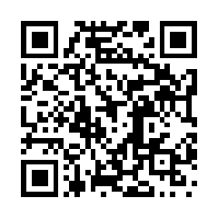

## 你认为历史上最令人毛骨悚然的照片是哪一张？

1\. 《秃鹫与小女孩》。这幅普利策获奖照片背后的故事极其令人心碎，摄影师在获奖四个月后自杀身亡。虽然有人指出照片经过裁剪，前方几英尺处其实就是救助帐篷，但那份绝望感依然挥之不去。

2\. 越南战争中被凝固汽油弹烧伤、赤身奔逃的女孩潘金福（Phan Thi Kim Phuc）的照片《战争的恐怖》。她至今仍然健在并从事倡导工作，但想到她一生都要背负着这张照片的阴影，整件事就显得更加沉重。

3\. 被困在泥浆与瓦砾中的哥伦比亚女孩奥玛拉·桑切斯（Omayra Sánchez）。每次看到那张照片我的心跳都会骤停，她在水和废墟中苦苦支撑了60个小时才离世，她那充血发黑的双眼和泡白的手掌成了无数人挥之不去的噩梦。

4\. 1980年圣海伦斯火山爆发时罗伯特·兰斯堡（Robert Landsburg）拍下的照片。他自知无法逃脱滚滚而来的火山碎屑流，在拍下最后几张照片后，冷静地把胶卷倒回相机、装进背包，然后用自己的身体扑在上面保护底片，直到被火山灰吞噬。

5\. 1970年造成惨烈伤亡的博拉气旋（Bhola Cyclone）相关照片。这场风暴被称为“差点毁灭世界的风暴”，不仅造成了空前绝后的大饥荒和人道灾难，甚至间接引发了一系列地缘政治危机与冷战对抗。

6\. 9·11事件中的《坠楼者》（The Falling Man）。很多人以为电视直播切掉了跳楼者的画面，但当年无数人在电视上亲眼目睹了这一幕，有人甚至牵着手一同跃下。办公室里的烈火炽热难耐，跳楼并不是一种选择，而是绝望中唯一的解脱。

7\. 9·11事件中顺着世贸中心北塔外墙立柱往下攀爬的男子。他从90多层徒手沿着窗柱向下挪动了二十多分钟，已经成功下到了火势蔓延的楼层下方，但所经之处的窗户全都是完好的，仅仅因为隔壁一列窗户才有破口而无法进入室内，最终在南塔倒塌的冲击中不幸坠落。

8\. 二战中纳粹别动队（Einsatzgruppen）屠杀犹太人的照片，例如《文尼察最后的犹太人》。受害者跪在巨大的乱葬坑前，坑里堆满了刚刚遇害的同胞，行刑者拿着手枪顶着他的后脑，周围全是一脸漠然的围观者。

9\. 挑战者号航天飞机解体爆炸的画面。乘员舱在爆炸后并没有立刻粉碎，残骸打捞出来时发现应急供氧设备已被手动启用，这意味着宇航员们在爆炸后依然活着并保持着清醒，在长达近两分钟的下坠过程中眼睁睁看着死亡降临，直到撞击海面。

10\. 考普兰七重星系（Copeland Septet）的深空巡天图像。单单一个星系就包含约3000亿颗恒星，当你不断把图像缩小、再缩小，那种无边无际的虚无与渺小感会带来彻头彻尾的宇宙存在主义恐惧。

11\. 奥斯威辛集中营特遣队（Sonderkommando）囚犯冒死偷拍的照片。正是因为艾森豪威尔将军当年预见到未来会有人试图否认大屠杀，才下令军旅摄影师尽可能详尽地记录集中营的证据。

12\. 两名风力发电机维修工人困在着火机舱顶部的照片。机组突发大火封死了逃生通道，两人在无路可退的高空紧紧相拥，最终双双罹难。

13\. 1954年普利策获奖照片《海边的悲剧》（Tragedy by the Sea）。画面中一对年轻夫妇并肩伫立在加州海滩边，就在照片拍下的几分钟前，他们年仅19个月大的儿子被卷入太平洋的巨浪中失踪了。

14\. 第一次世界大战中所谓“弹坑震荡症”（Shell Shock）士兵的照片。画面里的士兵在战壕中露出一抹诡异而空洞的冷笑，那种仿佛被战争彻底逼疯的怪异神态令人不寒而栗。

15\. 2015年叙利亚难民危机中两岁小男孩艾兰·库尔迪（Alan Kurdi）遗体被冲上海滩的照片。他俯卧在沙滩上的姿态就像在婴儿床里熟睡一样，这一幕击碎了无数人的心。

16\. 英国两岁幼童詹姆斯·巴尔杰（James Bulger）在商场监控录像里被两名十岁男童牵着手带走的画面。这张看似平常的抓拍背后，是一场极其残忍且震惊世界的谋杀案。

17\. 开膛手杰克最后一名受害者玛丽·凯利（Mary Kelly）的现场犯罪照片。照片中极其血腥残忍的毁损程度即便在黑白胶片下也令人毛骨悚然。

18\. 侵华日军七三一部队进行人体实验的相关影像与资料。那些灭绝人性的罪行令人发指，而战后部分主要罪犯为了逃避审判甚至将研究数据与外界达成豁免交易，更加令人愤慨。

19\. 比利时国王利奥波德二世统治刚果自由邦期间，一位名叫恩萨拉（Nsala）的男子呆坐在门廊前，凝视着自己五岁女儿被砍下的一只手和一只脚。这一切仅仅是因为他没有完成当天的橡胶采集配额。

20\. 1997年得克萨斯州贾雷尔F5级超级龙卷风“行走的死人”（Dead Man Walking）照片。该龙卷风进入拖车营地时几乎停滞不前，极其恐怖的撕扯力连地面的沥青路面都被生生揭起，避难所的混凝土屋顶被彻底掀翻。

21\. 斯大林时期政治清洗后对合影进行抹除修改的照片。原本站在身边的人被生生从历史影像中擦除，这种随意修改现实与历史的权力展现令人不寒而栗。

22\. 旅行者1号拍摄的《暗淡蓝点》（Pale Blue Dot）。在浩瀚无垠的宇宙深处，整个地球不过是一粒悬浮在阳光里的微尘，人类历史上所有的痛苦、恐怖和纷争全都发生在这个孤独的像素点上。

23\. 14岁非裔少年埃米特·提尔（Emmett Till）惨遭私刑折磨致死后开棺瞻仰的照片。他的母亲坚决要求举行开棺葬礼，就是要让全世界看清种族仇恨对一个无辜孩子犯下的残暴罪行。

24\. 奥斯威辛集中营的纳粹看守们在休假时唱歌跳舞、欢聚一堂的照片。这种将骇人听闻的暴行融入日常生活的平庸之恶，比任何直白的暴力画面都更加让人脊背发凉。

25\. 1983年拜福德海豚号（Byford Dolphin）钻井平台潜水钟减压舱爆炸事故的现场照片。由于瞬间经历了巨大的气压差，遇难者的躯体在瞬间被极端高压摧毁，死状极其惨烈。

26\. 连环杀手罗伯特·本·罗兹（Robert Ben Rhoades）在杀害14岁少女雷吉娜·凯·沃尔特斯（Regina Kay Walters）前为她拍下的照片。杀手强迫她穿上特定的黑色裙子并剪短头发，女孩眼中充满了绝望与纯粹的恐惧。

27\. 广岛原子弹爆炸后留下的“死者之影”。核爆瞬间产生的极端光热辐射将地面与台阶瞬间漂白，而坐在银行台阶上的人体遮挡了光线，在石阶上永远烙下了一道漆黑的人形阴影。

28\. 1933年约瑟夫·戈培尔在日内瓦被拍下的《仇恨之眼》。前一秒他还在对着镜头微笑，但在得知摄影师阿尔弗雷德·艾森施泰特是犹太人后，瞬间露出了极度阴冷、刻骨仇恨的眼神。

29\. 1991年菲律宾皮纳图博火山爆发时火山碎屑云在皮卡车后狂暴追逐的照片。遮天蔽日的浓烟巨浪几乎压在车辆头顶，宛如灾难电影中的末日景象。

30\. 1978年太平洋西南航空182号班机（PSA Flight 182）空中相撞后机翼起火、垂直朝地面坠落的照片。驾驶舱录音记录下的最后一句话是机组人员留下的“妈妈，我爱你”。

## 午睡睡得太沉，结果提前了9个半小时去上班

1\. 曾经半夜两点爬起来洗澡准备去上班，满脑子以为已经是早上六点。幸好住处离公司开车只要五分钟，开到公司才发现不对劲，只能吃点东西回家继续睡到真正该起的时间。以前做值班随叫随到的工作时也干过这种事，半夜起来开心地洗澡，丈夫走进浴室问怎么突然有时间洗澡了，回答说在准备上班，丈夫大笑着问「凌晨两点去上班？」，只能默默关掉花洒滚回被窝。

2\. 傍晚睡了个沉沉的午觉，醒来一看时间是6点18分，瞬间以为早晨上班要迟到了，慌慌张张往外冲。一出门看见男朋友正精神抖擞地打游戏，还一脸困惑地质问他怎么通宵打游戏到现在，结果男朋友笑得直不起腰，提醒现在其实是晚上6点18分。

3\. 1992年左右在瑞士，老爸清晨叫我起床，我穿上校服、吃完早餐、背好书包，老爸拿上公文包，开着开了二十年的老雷诺车送我去学校。开到校门口发现学校大门紧闭，才猛然意识到当天是瑞士的法定假日耶稣受难日。当时是四月早上七点半，外面冰天雪地，车里冷得直哈白气，父子俩在车里面面相觑，随后默默掉头回家，脱掉外套一句话都没说就各自回床上补觉，只剩老妈靠在厨房柜台边笑到发抖。

4\. 以前在酒店前台工作，下午两点帮一位客人办理入住，对方要求第二天早上六点提供叫醒服务。结果当天晚上七点，那位客人怒气冲冲地打电话到前台投诉漏掉了叫醒电话，只能耐心地向他解释：现在是晚上七点，我就是下午帮您办入住的那个人，我根本不值连班。他花了整整十分钟才反应过来。

5\. 放学或下班回家睡得太沉，醒来常常会彻底丧失时间感。有人醒来以为是第二天早晨，迷迷糊糊走到客厅，还十分纳闷全家人为什么大清早把晚餐当早饭吃，或者奇怪父母大清早为什么在电视上看晚间节目。正是因为搞混过12小时制的早晚时间，甚至因此睡过头错过早上的考试，很多人后来把手机、电脑和所有智能设备全都改成了24小时制。

6\. 上了一整周的高强度班，整个人精疲力竭，下班回家刚躺下一个小时手机响了。迷迷糊糊狂拍手机把它按停，然后爬起来穿衣服准备上班，嘴里还嘟囔着怎么感觉才刚闭眼天就亮了，直到妻子在一旁笑出声才清醒过来。

7\. 以前在车间上早班，下班跑完步洗了个澡，打算在晚饭前眯一会儿。醒来迷迷糊糊看表快六点半了，以为要迟到，跳上皮卡一路狂飙，开到大半路看着天空突然纳闷：今天早上的太阳怎么从西边升起来了？这才反应过来其实是同一天的日落。

8\. 还有人因为偏头痛发作，下班回家倒头大睡，晚上九点惊醒以为自己上班迟到了整整一个小时，急匆匆打电话给老板请假。电话刚挂，丈夫在一旁无语地问：你觉得大半夜九点给老板打电话请假合适吗？

9\. 年轻时曾犯傻挑战连续七天不睡觉，到了第七天晚上七点半实在撑不住倒头就睡。醒来看到表是七点半，头痛欲裂，以为自己睡了十二个小时正准备穿衣服上班，结果发现手机里全是老板愤怒的未接来电——原来这一觉直接不省人事地睡了整整三十六个小时。

10\. 作为一名学校早上七点半上课的老师，某天在七点半猛然惊醒，整个人陷入恐慌，疯狂给各个校领导打电话。打通后气喘吁吁地道歉说自己刚醒、会以最快速度赶到，对方在电话那头沉默片刻，平静地回答：「没问题，但今天是周日。」

11\. 类似的事情也常发生在周六：早晨猛然惊醒发现比平时上班时间晚了半小时，吓得魂飞魄散，以最快速度洗漱穿衣、跳上车一路狂飙到公司，停好车看到空荡荡的停车场，才一巴掌拍在脑门上想起来今天是周六。

## 有哪些名人做过的大恶，只有你还记得？

1\. 埃迪·墨菲当年与辣妹合唱团的 Mel B 生下孩子后拒不承认，直到女方闹上法庭做亲子鉴定才确认生父身份；而希亚·拉博夫曾公开承认自己虐待女性并传染性病。

2\. 圣诞老人只在极度需要红鼻子鲁道夫指路时才接纳它。歌里唱得好像大家能记住所有普通驯鹿的名字，唯独记不住最出名的这只——在你的天赋能帮别人收拾烂摊子之前，在他们眼里你永远只是个怪胎。

3\. 超模娜奥米·坎贝尔曾与爱泼斯坦过从甚密，爱泼斯坦案一发酵，她原本定期更新的个人频道就瞬间停更。她还曾拒绝就涉嫌种族灭绝的非洲独裁者出庭作证，被传唤迟到后大肆抱怨麻烦并涉嫌作伪证；此外她多次用手机狠砸助理与管家。

4\. 泰德·肯尼迪当年发生车祸把玛丽·乔·科佩奇尼留在沉入水底的车里溺亡，自己却拖延数小时才报警。这场丑闻虽然让他与总统宝座无缘，但他依然稳坐参议员之位，而且事故恰好发生在人类登月前一天，媒体关注度被极大地稀释了。

5\. 克里斯·布朗对蕾哈娜实施了极其严重的暴力殴打，当时警方的记录和伤情照片触目惊心，但他至今依然坐拥庞大粉丝群体并到处巡演捞金。

6\. 乔治·洛佩兹在妻子为他捐献了一颗肾脏之后出轨；纽特·金里奇也在妻子患癌住院期间背叛了家庭。

7\. 罗伯特·卡戴珊在警察与媒体的长枪短炮面前，堂而皇之地将辛普森的公文包从犯罪现场带走，随后立刻以辩护律师团队成员的身份获得免于作证的特权。

8\. 上世纪 70 年代的摇滚圈普遍受到过度纵容。史蒂文·泰勒当年不仅与一名未成年少女公开交往数月，还说服女方母亲签署领养协议使自己成为其法定养父，以便带着她四处巡演；吉米·佩奇、大卫·鲍伊等摇滚巨星在当年也都有涉嫌侵犯未成年人的恶劣劣迹。

9\. 卡尔·马龙在 20 岁时让一名年仅 12 岁的小女孩怀孕，并在女方 13 岁生下女儿后，几乎终其一生拒绝与这个亲生骨肉相认；他还在魔术师约翰逊公开病情后拒绝与其同场竞技。

10\. 在联邦政府正式向公众通报新冠疫情之前，多位美国国会议员抢先清仓了自己的股票投资组合以规避损失。

11\. 乡村歌手布雷克·谢尔顿曾故意驾车碾死路边的一只乌龟。无缘无故故意虐杀动物，是典型的反社会和卑劣人格体现。

12\. 罗素·克劳曾经在酒店里把电话直接砸在一名拿最低工资的前台行李员脸上。

13\. 知名主播马特·劳尔在 NBC 长期滥用职权性骚扰女性并打压同行安·库里的职业生涯，直到彻底被电视台开除后才从公众视野中消失。

14\. 苹果当年联手 U2 乐队，强行把那张难听的 U2 专辑直接塞进了全世界用户的 iPhone 手机里。

15\. 马克·沃尔伯格年轻时在波士顿街头多次犯下极其恶劣的暴力种族仇恨罪行。

16\. 特拉维斯·斯科特的 Astroworld 音乐节发生了造成多人死伤的踩踏惨剧，但事后克里斯托弗·诺兰依然选择在自己的电影里使用他的音乐。

17\. 查理·辛明知自己感染了艾滋病毒依然与多人发生无保护性关系，而且他曾是好莱坞著名老鸨的最大明星客户，案发后转头就把对方出卖给了警方。

18\. 汤姆·克鲁斯在全国电视直播节目中，公然严词斥责波姬·小丝服用抗抑郁药来治疗产后抑郁症。

19\. 亚瑟小子在明知自己患有生殖器疱疹的情况下传染给多名伴侣，面临多起诉讼并达成巨额私下和解，如今却依然以性感偶像的名头大肆巡演。

20\. 歌手 Post Malone 在 2019 年澳大利亚巡演期间捡了一只猫随队照顾，巡演结束后却将猫直接丢弃在体育馆的停车场里，那只猫后来在停车场生下了一窝小猫。

21\. 滚石乐队贝斯手比尔·怀曼在 47 岁时诱导并追求年仅 13 岁的曼迪·史密斯，几年后两人结婚；后来女方的母亲甚至转头嫁给了怀曼的亲生儿子。

22\. 杰里·塞恩菲尔德在 38 岁时公然与一名 17 岁的高中生约会，甚至经常开车到高中校门口接她放学，事后剧组全员帮其开脱，他也坚称彼此清白。

23\. 民谣三重唱组合成员彼得·亚罗是一名被定罪的性侵犯与恋童罪犯，甚至曾获得总统特赦；但在其去世时的悼念活动中，这一丑恶前科被公众记忆集体粉饰擦除。

24\. 埃米纳姆当年承诺只要粉丝给他写信他就会回复，结果写了那么多信连个回音都没有，简直是《Stan》的现实翻版。

25\. 梅尔·吉布森酒驾被捕时对女警大放种族歧视厥词，给前任留下的语音留言也充斥着极其下流恶劣的辱骂。

26\. 喷火战机乐队曾长期公开宣传极度危险的“艾滋病否认论”，不仅为拒绝抗病毒治疗的伪科学组织站台，还误导了大量轻信的患者延误救治。

27\. 莫特利·克鲁乐队的尼基·希克斯因为员工卫生间有人在用又懒得下楼，直接尿在员工休息室的水槽、放满洗净碗碟的沥水架和操作台上。

28\. 红辣椒乐队主唱安东尼·基蒂斯在自传中承认，得知同行的女孩年仅 14 岁且全州警方都在搜寻其下落后，不仅没有立刻收手，反而在送她回家前又与她发生了一次性关系。

29\. 二战期间美国政府签署第 9066 号行政令，以武力将 12 万名日裔美国人强行驱赶并关押进荒无人烟的集中营。

30\. 珍妮·麦卡锡在相关造假研究被彻底揭穿后，依然大肆散播“接种麻疹疫苗会导致自闭症”的谣言，一手延续了危害极深的反疫苗运动。

**今天还有这些热帖**

4\. 美国国债刚突破40万亿美元，对此你有什么感受？

5\. 长期婚姻或恋爱中有哪些没人提醒过的残酷现实？

6\. 有什么东西在2020年彻底消失，且再也没有回来？

7\. 自闭症谱系群体最冷门的特殊兴趣是什么？

8\. 查出胎儿出生后会是植物人，顶着所有人反对我依然选择堕胎

9\. 哪些已经停产停售的美食最让你念念不忘？

10\. 我用修图软件改了续租合同

11\. 如果绝对安全，你现在最想去哪里旅游？

12\. 有哪些旋律极其洗脑欢快，歌词却无比悲伤的歌？

13\. 有哪些人你虽然打心底讨厌，但不得不承认他们确实才华横溢？

14\. HBO雪花屏和标志性呼麦之后，你脑中会自动响起哪部剧的主题曲？

15\. 有哪些虽然学起来很费劲，但学会后极具价值的爱好？

16\. 往皮纳塔里塞什么东西最糟糕？

17\. 把红蜡烛放在向阳窗台上融化，把室友吓坏了

18\. 哪家店有一闻就能认出来的独特气味？

19\. 你这辈子读过最好的一本书是什么？

20\. 有什么作品的编剧水平能比肩《辛普森一家》的黄金期？

21\. 有哪些电影的结局让你怎么想都觉得不对劲？

22\. 有哪些常识或人生道理是你很晚才尴尬地明白的？

23\. 不喝咖啡的人，早上靠什么获得能量？

24\. 地球上哪种动物过得最轻松惬意？

25\. 如果能让一个社交平台一夜之间彻底消失，你会选哪个？

26\. 汉堡里放什么配料其实被严重低估了？

27\. 你在现实生活中绝不会对任何人说出口的癖好是什么？

28\. 今天我搞砸了，接下来一周我差不多要“半瞎”着过了

29\. 有哪些小众电影台词你常挂在嘴边但没人接得住？

30\. 长期慢性压力过后，是不是很难再深入思考任何事情？

<section style="margin:24px 0 0;padding:16px 18px;background:#f7f7f7;border-radius:6px;">
<table style="width:100%;min-width:0;margin:0;border-collapse:collapse;">
<tbody><tr>
<td style="border:none;padding:0;vertical-align:middle;">

长按识别二维码，在博客看全部 30 个热帖

https://blog.bhwa233.com/posts/reddit-2026-08-21-life/

</td>
<td style="border:none;width:96px;padding:0 0 0 14px;vertical-align:middle;">

</td>
</tr></tbody></table>
</section>
