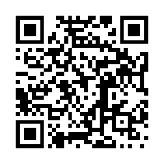

## 有哪些带点色气却让你记了很久的夸奖？

1\. “我太想让你让我怀孕了”——这句话不仅狂野，而且还是对方直接拿来当开场白讲的。评论里也有人在初次约会时听到女方说“我想让你当单亲妈妈”；还有人在派对上看到别人接吻，刚约会的女生转头对他说“那些人生的孩子肯定不好看，要是咱们俩生，绝对是世界上最可爱的宝宝”，瞬间让人领会了其中的暗示。

2\. 高中时班级组织去水上乐园，那是胶卷相机的年代。洗出照片后，我暗恋的女生把其中一张递给我，随口笑着说“我能看到轮廓哦”然后笑着走开了。当时我们穿的是紧身泳裤，侧光刚好勾勒出了下半身，那一刻我一边觉得尴尬，一边又因为暗恋对象的注视而暗自狂喜。另一位网友在游泳课出水时也有过类似经历，学姐直接走过来伸手划过轮廓说“看看这线条”，瞬间打破了两人之间的距离。

3\. “好想借你的脸用用。”对方语气极其自然，眼神直勾勾地盯着我，那一瞬间我的大脑彻底宕机了。在此之前完全没有任何调情铺垫，这句赞美完全是凭空砸过来的。

4\. 刚开始剃光头并认命自己再也长不出浓密头发时，正和一个墨西哥姑娘约会。她回老家探亲时给我发了条短信：“不知怎么搞的，我现在只要一看到光头男就特别有感觉。”这句话成了我低谷期随身携带的救心丸。

5\. 朋友安排了一场相亲，见面时我礼貌地伸手准备握手说“很高兴认识你”。女方握住我的手翻过来仔细端详，看着我的眼睛说：“你的手指看起来很有劲。”那场约会后续进展得极其顺利。

6\. “你有一种让人特别想睡的性格魅力。”我觉得自己的人格魅力大概在18岁那年就已经登顶了。

7\. 亲热结束后对方认真地来了一句：“就这水平，你完全可以收费了。”作为一个男生，这句话让我记了很久。也有人在替伴侣服务完后被问“你以前是不是干过专业这行”，只能哭笑不得地表示纯粹是出于对这项爱好的热情。

8\. 高中时有个女生特别喜欢摸我的手。因为我经常劈柴，手掌粗糙且满是老茧，看起来像历经沧桑的中年人。她总会在课间特意跑来找我，一边摸一边惊叹连连，那种感觉奇特又让人暗爽。

9\. “好想把你当树一样爬上去。”作为一个身材高大的男生，听到这种比喻印象极为深刻；不过也有高挑的女生表示常被矮个男生这么夸，一时不知该如何接话。

10\. 在奥斯汀的酒吧里遇到当地著名的传奇流浪汉，因为敬重他是本地红人，我便主动提出请他喝一杯。我是一个黑人小哥，他打量了我一番说道：“你让我想起我最喜欢的咖啡……浓烈、纯黑，还带着一股狂野的骚味。”

11\. 健身一年半后在机场偶遇很久没见的老朋友。她看到我时直接吹了声口哨喊道：“身材不错啊！”那是我第一次从别人口中确认自己的体型变化，给了我极大的鼓励。

12\. 曾经被直白地评价“你真的很下流”，但对方眼神里全是渴望与肯定，完全是当成至高褒奖说出来的。

13\. 十年前在酒吧偶遇老同学叙旧，肩膀突然被拍了一下。回头看到一个陌生女人站在旁边问我叫什么名字，我下意识回答“史蒂夫”，她接着说：“这样我待会儿自己动手的时候就知道该喊谁的名字了。”当时震惊到甚至忘了该不该觉得被冒犯。

14\. “我不知道你是第一个懂得讲究个人卫生的男生，还是你本身味道就这么好，但尝起来真的太赞了。”

15\. 曾被伴侣认真夸赞“你的耐力是我这辈子见过最强悍的”，哪怕后来分开，这句话的自信加成依然在。

16\. “考虑到你偏瘦的体格，这尺寸比想象中大多了。”虽然听着像明褒暗贬的转折句，但每次回想起来依然觉得很受用。

17\. 第一次约会结束后，对方精疲力竭地躺着感叹：“咱们以后绝对得经常这么干。”也有人听到伴侣完事后惊叹“我以前从不知道原来这种事能这么舒服”。

18\. “遇到你之前，我从来没有产生过想咽下去的冲动。”这种直接的肯定杀伤力极强。

19\. 来自一位双性恋女孩的最高级评价：“你口活好得像个女同一样细腻。”

20\. “天哪，你把我填得太满了。”哪怕过去了二十多年，这句话依然在脑海里反复回响。

21\. 女友经历了一个月的繁重工作，周末我特意做了一顿她最爱的烧烤犒劳她。吃完饭后她抓住我的手臂认真地说：“这个周末我完全由你掌控，你随时随地可以对我做任何事；如果你吩咐我做某件事我没做好，你拥有任意惩罚我的完全许可。”那个周末两人都打开了新世界的大门。

22\. 感冒导致嗓音沙哑低沉时，被女生评价“你的声音正在让我产生一种不该有的感觉”，甚至开玩笑说“真想把你的声音和人一起打包带回家绑起来”。

23\. 第一次约会时被评价“你身上有种让人上瘾的特质”；而在亲热过程中对方又忍不住喘息着说“你实在是太让人招架不住了”。

24\. “你的弧度长得太完美了，每一次推进都精准击中要害。”这种针对身体细节的具体肯定让人印象极其深刻。

25\. 分开十年后与前任在老家重逢，聊天时对方感慨：“这么多年过去，我依然没遇到过能像你那样带给我极致体验的人。”

26\. 前任曾发信息吐槽：“你彻底把我的标准毁了。现在每次别人碰我，我都会沮丧对方为什么没有你的技术，你当年简直把我的灵魂都吸走了。”

27\. 高中课堂上一位素不相识的女生当着全班同学的面突然对我说：“好想把你当冲浪板骑。”全场陷入死寂，尴尬之余却成了记忆里最深刻的片段。

28\. “宝贝，你的舌头简直有魔力，我真该去给它投一份巨额保险。”

29\. “你这副体格，看起来能直接把我的膝盖折到肩膀上。”

30\. 亲热结束后找刚在一起的女孩要支烟抽，她满脸笑意且热情地回了句“这是你应得的奖励”，那种成就感比任何夸奖都更让人飘飘然。

## 哪些残酷细节能说明一个人没有自己以为的那么好看？

1\. 在合照时被大家默契且永久地指定为摄影师，或者是别人当着你的面毫无防备、巨细靡遗地描述自己的理想型，而你发现自己连其中一条都不沾边。人们只有在面对潜意识里早已彻底排除在择偶范围之外的人时，才会如此放松地大谈择偶标准。

2\. 很多人的外貌其实处在薛定谔的状态：看某些照片觉得自己帅呆或美翻了，看另一些照片又觉得自己蠢得无可救药；在家不修边幅、戴着眼镜套着大号T恤时看起来像几个星期没洗澡，稍微打理一下发型、涂点睫毛膏换身衣服又瞬间判若两人。这并不意味着你丑，只说明你是绝大多数普通人——精心打扮时中等偏上，彻底摆烂时泯然众人。

3\. 光环效应是双向的。长得好看的人犯了错往往更容易得到宽容，而普通或不好看的人犯错则很难得到体谅。有盲人网友提到，单凭别人交谈的反应就能判断谁好看：当一个讲着极度无聊故事的人却能收获全场热烈回应和专注倾听，而真正有趣或聪明的人却频繁被粗暴打断时，十有八九是因为前者的长相优势。很多人在大幅减重后才发现世界对待自己的态度彻底变了，曾经觉得你怪异讨厌的人突然认为你幽默迷人，路上对陌生人微笑也能得到热烈的回应。

4\. 小孩嘴里吐出的真话最扎心。二十多岁坐电梯时有人问我是不是模特，二十年后朋友的儿子盯着我认真地说我长得像《银河护卫队》里的格鲁特，还有四岁小孩直接说长辈的身材像宝可梦里的超梦。

5\. 身边朋友从来不主动给你介绍对象；当你表现出对某个共同好友有兴趣并想主动出击时，周围人会集体劝退你，甚至找借口说“我觉得对方好像已经有喜欢的人了”。

6\. 所有人潜意识里都默认你是单身，而当大家得知你居然在谈恋爱时，脸上露出的不是好奇而是发自内心的极度震惊，并且他们平时也从来不会好奇地问你“条件这么好怎么还单着”。

7\. 从身材匀称到中年发福，最直观的体验就是自己仿佛瞬间在大众视野里“隐形”了。年轻时去哪儿都能感受到关注与优待，发胖衰老之后连原本热情的同事态度都变了，以前开车违规警察可能只给口头警告，现在则是毫不留情直接开罚单。

8\. 在社交中需要不断主动向别人强调自己“其实挺好看的”，或者极度认真且频繁地把“颜值最大化（looksmaxxing）”这类词挂在嘴边；又或者总是在朋友和伴侣面前变相讨要外貌夸奖来获取安全感。

9\. 永远对自己被拍出来的照片不满意，坚决认定是光线太烂、角度太刁钻或者拍照人的技术不行，只有在极度特定的角度和摆拍姿势下才肯发照片，而那张照片往往已经修得完全不像本人。

10\. 长期在婚恋市场上屡屡碰壁，却始终坚信“只是好人都被挑走了”或者“我只是眼光高”。长期受挫往往不是因为运气不好，而是严重高估了自己的吸引力，一直在执着追求远超出自己匹配范围的对象，并拒绝调整预期。

11\. 跟着一个真正顶级好看的朋友出门待上一整天。路过加油站、逛街买衣服或者在餐厅吃饭，沿途所有人都会主动让路、搭讪、送饮品，甚至有同性陌生人直接走过来惊呼“天哪你美得不可思议”。亲眼见识过顶级吸引力所带来的现实待遇后，才会明白平时自以为的“还不错”和真正的惊艳之间有多大的鸿沟。

12\. 还有些瞬间让人彻底断了念想：比如年轻时跟人暧昧聊天，对方问最喜欢什么角色，刚回答完，对方就回了一句“我觉得你长得更像咕噜”然后瞬间拉黑；或者每次走进超市，店里的便衣保安就如临大敌般全程尾随，仿佛你随时准备把货架洗劫一空。

## 曾经身材极佳后来发福的人，变胖后最让你意外的是什么？

1\. 变胖实在太容易了，而且速度快得惊人。保持热量缺口需要极强的自律，但要吃出 1000 卡路里的热量盈余简直轻而易举。很多人因为生活打击、工作压力或药物副作用导致食欲暴增，短短几个月甚至几周内体重就飙升了几十磅。以前以为变胖需要很多年，现实往往只需几个月的时间。

2\. 自信心会断崖式下跌，整个人时时刻刻都觉得生理上极其难受。睡眠变差、浑身酸痛、动不动就一身虚汗，所有原本让人享受的体育运动都变得痛苦不堪。更糟糕的是周围人态度的转变，以前身材好时大家都更友好、笑容更多，变胖后不仅没人把你当回事，很多时候甚至会遭到冷落或区别对待。

3\. 动起来的时候肚子会开始晃荡。对于几十年里身上从不乱晃的人来说，这种感觉就像自己变成了一盒果冻。不仅是肚子，连下楼梯时都能明显感觉到胸前的肉在抖动，做跳蹲之类的动作更是灾难。

4\. 变胖的过程很爽，但处于肥胖状态非常痛苦；保持好身材很爽，但减脂的过程极其痛苦。虽然刚开始发福且还保留着底子时会有一段短暂的“黄金期”，但长胖后带来的全天候不适感会迅速将其淹没。买衣服也成了折磨，无论怎么选版型都极其别扭，甚至找不到一条舒服的内裤。

5\. 最让人破防的是隐私部位看起来和感觉上都变小了。随着耻骨区域脂肪堆积，下体就像被埋进了雪堆里，整个人不仅性欲大减，有时候坐下甚至会出现肉眼可见的“内陷”，视觉和心理打击巨大。

6\. 日常生活中的细小动作全变成了挑战。弯腰系鞋带甚至需要深吸一口气憋着；从地上、沙发上或床上站起来变得异常吃力；走上一段楼梯就气喘吁吁，赶个公交心率能直接飙上去，需要缓好几分钟。

7\. 变胖会让腰背和关节承受极大的折磨。背部疼痛会让所有事情都变得艰难，早上起床甚至无法直立行走；膝盖和关节也开始隐隐作痛，去徒步或散步一小时，第二天全身僵硬得动弹不得。

8\. 很多人其实并不是放任自流，而是生活重担与变故的连锁反应。照顾生病的亲人、加班熬夜、伤病导致无法训练，随之而来的就是恶性循环：越疼越动不了，越动不了胖得越快，而变胖又进一步加剧身体疼痛和精神内耗。

9\. 发福后不仅体温普遍偏高、极其容易出汗，甚至洗完温水澡后半小时身上依然在淌汗。此外，身上的皮肤还会被撑出红色的妊娠纹，甚至能明显感觉到血液流动带来的沉重压迫感。

10\. 肥胖还会摧毁人的自律能力。当身体状态恶化、体内激素和神经递质失衡时，原本在健身房里的意志力和控制力会彻底瓦解。脑子里明明懂得所有减脂原理，却发现自己根本无法像以前那样严格执行，那种无能为力的挫败感极其折磨人。

## 曾经风靡一时但如今真正走向没落的游戏类型有哪些？

1\. 网页小游戏基本上已经名存实亡。当年 Flash 播放器的停用直接终结了一代人的网页记忆，无数经典老游戏彻底无法运行。更受欢迎的作品要么转战移动端沦为充斥微交易的课金机器，要么被新一代沙盒与平台彻底取代。

2\. 即时战略游戏（RTS）在世纪之交曾统治整个行业，《星际争霸》《魔兽争霸》《命令与征服》是无数人的青春。现在这类游戏太难做成爆款，多数新作也难以摆脱老套路的换皮感，整个品类全靠忠实老玩家、大型社区 MOD 以及偶尔冒出的精品苦苦支撑。

3\. 音乐和节奏类游戏曾经在实体店里独占一整排货架，如今在主流主机上几乎绝迹。这个品类除了退守 VR 平台和日本街机厅外，主要是因为玩家社区彻底掌控了生态：当玩家能在《Clone Hero》这类社区作品里免费畅玩几百万首自定义曲目时，商业厂商无论出什么带几十首歌的新作都毫无竞争力。

4\. 2D 点击解谜与冒险游戏在经历了上世纪黄金期和 2010 年代的短暂回暖后再次边缘化。原本触摸屏是最适合该品类的载体，但手游市场追求短平快，玩家很难在手机上沉下心打通一部长篇解谜，这类玩法现在更多演化为了独立推理悬疑作品。

5\. 像《烈火战车》《横冲直撞》这种以载具战斗和破坏为核心的赛车游戏几乎绝迹。事实上除了硬核赛车模拟器和极少数开放世界竞速大作外，包括《火爆狂飙》《极品飞车》在内的传统街机风格娱乐赛车都已风光不再。

6\. 本地分屏与同屏合作游戏（Couch Co-op）几乎被大厂遗忘。以前两个人挤在沙发上一台电视打通宵是常态，如今除了《双人成行》或少数独立游戏，主流 3A 大作几乎不再提供能让两个人在本地无缝共享进度的分屏战役。

7\. 纯粹的潜行暗杀游戏几乎灭绝了。《细胞分裂》《神偷》那个时代靠严谨光影与环境机制驱动的纯潜行玩法难以在高画质大作中平衡，如今各大厂商只是把潜行做成开放世界里的通用附属机制，再也没人愿意做纯潜行核心体验。

8\. 竞技场射击游戏（Arena shooters）在经历了《雷神之锤 3》和《虚幻竞技场》的辉煌后已死去多年。市场先是被英雄射击瓜分，紧接着被大逃杀和撤离类射击占领，那种纯靠身法、抢资源点和高速枪法决胜负的快节奏竞技彻底失去了大众市场。

9\. 大逃杀类游戏也正在肉眼可见地降温。在巅峰期几乎每款射击游戏都硬塞一个吃鸡模式，极度的市场饱和让大量跟风作品活不过两周，即便是头部作品对年轻一代的吸引力也开始下滑。

10\. 大型多人在线角色扮演游戏（MMORPG）陷入了没有厂商敢做新项目的死局。开发成本极其高昂，而老玩家在现有的老牌 MMO 中投入了数千小时与深厚的社交资产，新游戏只要稍有瑕疵就会迅速暴毙，难以吸引玩家抛弃旧天地。

11\. 3D 平台跳跃游戏如今罕有大厂涉足，除了任天堂的马里奥和索尼的《宇宙机器人》等极少数标杆外，大预算大制作几乎绝迹，整个品类几乎退守成了中小成本独立开发者的领地。

12\. 以单人战役为核心卖点、多人模式仅作为补充的传统线性第一人称射击游戏越来越少，取而代之的全是长线运营服务型射击；同时真人互动影视游戏、实体联动玩具游戏以及能让玩家真正永久买断离线拥有的游戏模式，也都在被现代游戏工业逐步淘汰。

## 在赌场工作或常去赌场的人，你见过最疯狂的事是什么？

1\. 80年代末在赌场当发牌员，见过一个醉汉兜里揣着5英镑走进来，最后带着4.1万英镑离开，在当年那笔钱足够全款买套房子。还有一次我发二十一点时，有赌客把点燃的雪茄直接按在我手背上掐灭，我当场反手给了他一巴掌。第二天经理把我叫进办公室，说客人道歉了，但我也必须向客人道歉。我当场辞职，买了张去迈阿密的机票，挨家挨户敲游轮公司的门找赌场工作。那年我19岁，觉得自己刀枪不入，可惜手背上的疤留到了今天。

2\. 年轻时有次跟朋友玩嗨了，突发奇想开了一小时车跑去印第安保留地的赌场，两人兜里各自只有100美元。我们在那遇到了我表哥，他问我们玩过二十一点没，我说知道规则但没玩过。表哥就带着我们坐下一边教潜规则一边打，最后我揣着1300美元离场，朋友赢了900美元。等药劲差不多退去、脑子开始清醒时，我转头问朋友：“你想不想成为这间赌场里最聪明的人？”他立刻懂了我的意思，我们拔腿就走。

3\. 二十岁出头在牌桌上打德扑，左手边的大哥跟我聊得火热，说自己已经输了5万美元，今天不捞回来绝对不下桌。因为我就住在赌场酒店里，第二天中午下楼吃午餐时路过牌桌，发现他依然坐在同一个位置上。我心里有一丝希望他回本了，但理智告诉我他只会被吃得渣都不剩。

4\. 在赌场做客房服务送酒，电梯门一开，一个西装革履的老先生整个人蜷缩在电梯角落的地板上。我问他需不需要叫人帮忙，他神色平静、毫无波澜地回了一句：“我输了一百万美元。”剩下那段电梯成了我人生中最尴尬漫长的几分钟。

5\. 老虎机上方的轨道灯起火，燃烧的碎片像下雨一样掉在机器上，保安不得不强行把赌客从机器前拖走，因为这群人居然一边拍掉头发和屏幕上的火星一边继续狂按。还有一次天花板漏水直往下滴，为了不打断连胜运，玩家死活不肯走，最后保安找来一张巨大的透明塑料布，把整排机器和坐着的人一起盖在下面继续赌。

6\. 当发牌员时有个常客整天泡在桌前，他为了不离开座位上厕所从而“打断赢钱运”，竟然自愿去医院插了导尿管，还到处跟人炫耀，可他实际上几乎就没赢过。还有很多赌客干脆穿上成人纸尿裤，甚至有人把孩子辛辛苦苦攒下的零花钱翻出来全输光，病态得令人窒息。

7\. 在掷骰子桌上，有个男子自命不凡地把1.5万美元现金像撒花一样甩得满桌都是，荷官直接拿起推杆把所有钱当垃圾一样全铲回他面前，冷冷地说想玩就先学会像个绅士。结果这人下一把按每投5000美元下注，连掷三次全输光。

8\. 老虎机软件工程师表示极度讨厌自己的工作。最让人看不下去的是毫无希望的重度赌瘾者：插着氧气管的老太太往机器里塞20美元钞票的速度，快赶上机器吞钱的极限；还有人直接包下一整排机器，像巡逻一样来回走动狂拍旋转键，甚至完全不看屏幕上滚出的结果。

9\. 低投注区的机器永远坐满了重度上瘾的老太太，赌场开门前就在排队，整天玩5美分的档位。有天一位老太太悄无声息地死在机器后座上，赌场连门都没关，只是把低投注区域单独拉上了警戒线。

10\. 90年代在小赌场发牌，一个穿着降落伞裤、顶着挑染发型的年轻人狂掷重金，输光后毫无表情地走开。片刻后他径直挤回我的桌前，背对着我开始扭动，随后在一秒钟之内把降落伞裤褪到脚踝，当场在桌前脱裤撒野。

11\. 朋友吃完海鲜自助大餐又喝了烈酒，坐在二十一点桌前突然喷射性呕吐，吐得满桌、满牌、连发牌员身上全是一层黏糊糊的海鲜浓汤。同桌的赌客连自己桌上的筹码都顾不上拿，当场作鸟兽散。

12\. 作为志愿消防员，有次当地遭遇洪水，我们被叫到一家地下室被淹的赌场排险。赶到现场时水已经漫到了脚踝深度，令人震惊的是，满屋子的赌客依然泡在水里淡定地拍着老虎机。

13\. 玩便士老虎机的男人纸尿裤彻底兜不住了，他一边对着机器狂怒仿佛机器抢了他的钱，一边一只手提着裤子防止继续往下漏，另一只手不停往里塞一美元纸币。保安习以为常地递给他纸巾让他别蹭到椅子上，最后他兑出42美元，留下一张满是污渍的湿椅子扬长而去。

14\. 掷骰子桌上总能见到以为自己能靠特定手法“控球”的人，输掉成堆的钱，但他们的自信心却从不减弱分毫，仿佛只要意念够强就能对抗台面上那些专门打乱骰子落点的金字塔减震胶垫。

15\. 赌场酒吧常客在小便池里脱光裤子大便，被吧员质问后直接转过身对着地板乱尿，甚至光着屁股气势汹汹地要跟赶来的保安决斗，毫无悬念地被当场制服。

16\. 德州扑克锦标赛正打着，一位年轻妈妈提着婴儿提篮冲进场，直接把刚出生不久的婴儿放在牌桌正中央，对着4号位的丈夫怒吼：“既然你不想回家看孩子，那你就坐在这里看！”随后摔门而去。丈夫尴尬地抱起孩子赶紧追出去，发牌员为了缓解死寂的气氛调侃了一句：“孩子可不能这么养（raise），这可是台面下注规则！”

17\. 朋友的前男友沉迷电子基诺机，年薪7.5万美元，外加一栋价值30万美元的房子，最后全被那些赔率极低的破机器吞得一干二净，彻底输掉了整个人生。

18\. 遇到大面积停电时，机器全部黑屏，我们必须人工核算给上千名客人手动派发现金，结果整群老头老太瞬间将员工死死围住，场面失控得像是要引发暴动。

19\. 90年代欧洲赌场监控密布，到处贴着国际老千团伙的大头照。这些团伙无所不用其极，有人在手掌上涂满胶水，假装靠在赌桌上顺手粘走筹码，还有专门配齐算牌团队全方位钻漏洞的。

20\. 救护人员赶到赌场对一名在轮椅上失去呼吸的老人进行心肺复苏，周围打老虎机的赌客却死活不肯挪开哪怕半步，甚至愤怒地大吼：“这是我的机器，我绝对不挪！”为了不打断自己的游戏，对身旁的生死抢救毫无悲悯。

21\. 欧洲夜班赌场在清晨4点夜店关门后，常涌入吸毒狂欢后的VIP。一位熟客进门要烈酒被拒后给了200欧元小费改要甘菊茶，随后转头去玩轮盘，输红了眼后当场脱下裤子直接尿在轮盘赌桌上，随即被终身禁入。

22\. 丈夫突发心脏病倒地，急救人员需要从妻子的手提包里拿急救药，妻子却舍不得松开正在拉老虎机的手，头也不回地说机器马上要吐奖了不能停。丈夫最终在救护车上去世，妻子随后被指控过失杀人。

23\. 好友夫妇去赌场前立规矩每人最多输500美元，中途手气爆棚中了1.5万美元大奖，赌场殷勤地免费送了他们一晚高级套房庆祝。第二天朋友垂头丧气地告诉我他们输得精光，不仅1.5万奖金全倒贴回去，还额外亏了原本的50美元——他们这才明白为什么赌场会那么大方地免费赠送客房。

24\. 参与建造一家极度奢华的赌场，开业前三天老板视察，认为地毯颜色是“血红”而不是他要的“龙红”，一声令下将全场数万平米地毯全部掀掉重铺，光换地毯就烧了3000万美元。开业当天客人的烟头直接掉在崭新的地毯上，赌场的应对方案是每周用机器把地毯表面刨削掉3毫米去烫痕，削到底了再整批换新。

**今天还有这些热帖**

6\. 哪个电视广告是你这代人全都知道、年轻人却毫无概念的？

7\. 面试时说过最蠢的一句话是什么？

8\. 你有哪些情趣用品？它们真的好用吗？

9\. 如果明天醒来账户多出一万美元且必须当天花光，你会买什么？

10\. 双胞胎父母在宝宝刚出生的前几周，搞混过谁是谁吗？

11\. 我的怪物史莱克内裤让我免遭性侵

12\. 你买过体验最好的订阅服务是什么？

13\. 成年男性没有老婆、女友和孩子有哪些好处？

14\. 有什么食物是你第一次吃就被惊艳到的？

15\. 你亲眼见过最令人痛心或最强烈的成瘾是什么？

16\. 哪家快餐连锁店让你纳闷它怎么还没倒闭？

17\. 巨蟒剧团（Monty Python）最经典的台词是哪一句？

18\. 别人对你说过最狠、至今仍让你耿耿于怀的一句话是什么？

19\. 以前觉得在感情里不可或缺、真正恋爱后才发现没必要的东西

20\. 人身上有哪些常被忽视、直到为时已晚才察觉的危险信号？

21\. 分不清 your 和 you’re 等基础语法，是否足以看低一个人的智力？

22\. 穿旧鞋去面试，结果鞋底当场开裂散架

23\. 如果完全不缺钱，你会为了好玩去做什么低压工作？

24\. 三十多岁时，对健康最好的事是什么？

25\. 每周实际工作不到一小时却拿满全职薪水

26\. 成为父亲后，你对人生的看法发生了怎样的改变？

27\. 有哪些事情只有亲身经历过才能真正理解？

28\. 如果钱不再是问题，你会让什么对所有人免费？

29\. 哪个虚构角色的死亡真正让你为之哀悼？

30\. 我在婚礼祭坛前被悔婚抛弃了

<section style="margin:24px 0 0;padding:16px 18px;background:#f7f7f7;border-radius:6px;">
<table style="width:100%;min-width:0;margin:0;border-collapse:collapse;">
<tbody><tr>
<td style="border:none;padding:0;vertical-align:middle;">

长按识别二维码，在博客看全部 30 个热帖

https://blog.bhwa233.com/posts/reddit-2026-08-22-life/

</td>
<td style="border:none;width:96px;padding:0 0 0 14px;vertical-align:middle;">

</td>
</tr></tbody></table>
</section>
