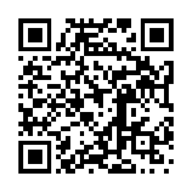

## 男人真的喜欢在睡梦中被做爱叫醒吗？

1\. 我完全不介意，唯一的后果就是上班迟到了。有人带过的暑期实习生平时既准时又积极，有一天直到午饭时间才满脸笑容地赶来，坦白说昨晚终于和苦追的同批姑娘在一起了、实在精疲力竭，主管也只能笑着给他准假；还有人表示如果伴侣突然在早晨付诸行动导致要迟到二十分钟，那自己干脆就迟到三十分钟。

2\. 男人并不是铁板一块，各人喜好完全不同，甚至取决于当天的具体状态。上了年纪后，后半夜的睡眠基本都围绕着憋尿展开，而且生理机能也不像年轻时能随时无缝换弹；周末可能欣然接受，但要是周二凌晨两点、几小时后还得赶去上班，被弄醒只会让人烦躁，甚至在半梦半醒中本能地把对方拍开。

3\. 很多人最大的阻碍是生理需求：睡了一整晚后早晨百分之百想去尿尿，憋着尿又勃起的状态体验并不美妙，而且不少人坚持必须先去上厕所和刷牙，导致大半时间都在纠结“我得在气氛彻底失控前说点什么，但又怕扫了兴”。不过也有人经历过憋尿时的极度高潮，虽然带着痛感，但强烈得令人难忘。

4\. 有女方分享自己曾有几个月几乎每天早晨都直接跨坐上去把丈夫叫醒，对方从没有过任何反对；也有人表示自己很喜欢晨勃时翻身给伴侣口交，甚至希望对方裸睡以便随时展开行动。

5\. 原则上非常欢迎，但前提是两人都没生病、早上也没有急着要办的事。尤其是家里有婴儿的夫妻，日常永远处于疲惫或生病状态，根本不可能在半夜或清晨产生这种兴致，因此千万不能擅自预设，必须先跟伴侣沟通清楚。

6\. 曾经的前女友有个最棒的叫醒方式：趁我半梦半醒躺在床上时直接跨坐到我脸上，就像整个人醒在一场肉体风暴里，虽然两人后来因人生规划不同和平分手，但那依然是这辈子最美妙的晨起记忆。

7\. 醒来发现伴侣正准备坐下来，绝对是哪怕到了临终走马灯里都会反复循环播放的高光时刻；相比于现实中一睁眼面对的是催着做家务的伴侣、端着洗衣篮的脚步声，或是小孩在床上跳着大喊天亮了，被这种方式叫醒简直宛如天堂。

8\. 很多人将早晨被口交叫醒视为人生的顶级体验之一，但时间点很关键：清晨醒来时可以，半夜熟睡时被弄醒则不行。

9\. 关键在于必须有明确的知情同意。在对方毫无防备的睡眠状态下直接进行性行为，如果事先没有沟通好，很可能会变成极具侵犯性的体验；即便在正常关系里，也可以先从亲吻、抚摸试探开始，给对方拒绝或清醒的余地，而不是完全搞突袭。

10\. 刚恋爱第一年觉得这简直太棒了，但结婚十年后往往只会变成现实的清点：“我八点半有个会，保姆八点到，咱们还是下班后再做吧，你买润滑剂了吗？”

11\. 也有相当一部分人坚决拒绝。刚醒来时整个人晕头转向、浑身黏腻，根本无法进入状态；而且办完事后往往会更困，不想刚醒来又被迫陷入困倦，更不想连自己什么时候起床的权利都被别人剥夺。

12\. 很多人喜欢这个主意，但讨厌被叫醒的过程。刚被碰的时候可能会在半梦半醒间本能大喊“别碰我的货物”，但等彻底醒来、抱在一起温存十几分钟后，状态就完全到位了。

13\. 对部分人来说睡眠是神圣不可侵犯的，除非房子着火或者发生紧急灾难，否则天大的事也别在没睡饱时把人弄醒。

## 医护人员希望患者明白的就医常识

1\. 在急诊室排队等待其实是一件大好事。急诊的逻辑是按危急程度分诊，你绝对不会想成为一进门就被全套医护人员围着转的人；如果医生在你病房里待的时间很短，说明你的情况完全可控，如果医生一直留在你床边还频繁找家属谈话，那才真正说明情况凶险。

2\. 很多经历过极速就诊的患者对此深有体会。有人刚走进急诊大门十五分钟内就被医生护士围住、直接推注吗啡并推进CT机，最后查出是面部蜂窝织炎已经扩散至眼眶；还有人因右下腹痛就诊，二十分钟后对门聚集了三位心脏病专家和两名医学生，查肾结石反而意外揪出了随时可能致命的心脏异常。

3\. 真正处于最高危级别的患者会被直接推入抢救室且医生即刻到场，这代表医护认为患者在接下来一小时内有极高的死亡风险。比如刚吃完没吃过的水果就全身起荨麻疹且呼吸困难，或者急性会厌炎导致吞咽困难、发声含糊，这些都是被立刻收治的危急情况。

4\. 重症监护室里常常靠药物和仪器将患者的生命维持在远超身体自然承受力的状态，很多时候这只是为了给家属留出接受现实的时间。这绝不等于患者正在康复，面对生命走向自然终点的患者，最仁慈的做法往往不是要求他们继续死撑或不惜一切代价抢救，而是握着他们的手表达爱与感激；给年过九旬的老人做胸外按压按断肋骨，对患者、家属和医护都是巨大的痛苦。

5\. 康复理疗的效果完全取决于患者在诊所之外的自我执行。如果仅仅在每周见理疗师的那几十分钟里活动，回家后完全不按要求做训练，病情绝不可能好转，很多人误以为理疗是某种能一劳永逸解除病痛的被动治疗，实际上自我锻炼才是核心。

6\. 恢复健康需要患者自己付出努力，无论是遵医嘱戒烟、做伤口护理还是按时服药。医生的作用是有限的，如果患者自己拒绝配合、继续长期卧床或不良生活习惯，医护人员也不会把有限的精力耗费在无休止的催促上，只能转向其他愿意配合的患者。

7\. 医生多开药物、检查或建议接种疫苗没有任何提成。事实上，不做这些复杂沟通、把看诊时间压缩到极短反而能让医生看更多病人、少花业余时间跟进结果，医生开具检查完全是出于病情评估的需要。

8\. 叫救护车去医院绝不意味着可以插队优先看病。急救人员和调度员完全按照病情的致命程度进行分诊，为了不想在候诊室排队而拨打急救电话，不仅到了医院依然会被轮椅推进普通候诊区等待，还会占用真正危及生命的急救资源。

9\. 请务必保持规律的身体锻炼。随着年龄增长，长期缺乏运动导致的体能退化会越来越难逆转，老年人能否在无需搀扶的情况下独自从马桶或椅子上站起来，是预测健康和寿命的重要指标。

10\. 大多数急诊和门诊的排查检查是为了排除最危险的致命情况，比如确认胸痛不是心梗、大面积肺栓塞或恶性肿瘤，但并不一定能立刻确诊某些慢性或复杂症状的具体病因。

11\. 医生和护士对就诊流程、预约时长以及保险报销规则并没有决定权。面对每次仅有十多分钟的看诊时间和繁琐的行政要求，医护人员同样感到沮丧，这种制度压力往往是导致医护疲惫和沟通仓促的根源。

12\. 有些没有生活质量的痛苦状态比死亡本身更折磨人。为了维持微弱生命体征而长期经历巨大痛苦，往往会彻底摧毁患者最后的尊严与生活质量。

13\. 神经系统疾病非常复杂，医学界每年都在发现新的病种，暂时无法给出明确的病名并不代表医生不在意，在很多情况下控制住症状、保障生活正常运转才是首要目标。

14\. 疫苗是现代医学最有效的救命发明之一。如果带着未接种疫苗的孩子就医，必须如实告知医生，因为未接种状态会彻底改变风险评估方案，迫使医生进行更多原本已经少见的严重疾病排查。

15\. 普通感冒或咳嗽流涕三五天大多属于病毒感染，根本不需要使用抗生素，滥用抗生素不仅对病毒无效，还会带来耐药性和肠道菌群失调等副作用。

16\. 当医护询问饮酒史或违禁药物使用史时，唯一的目的是评估用药配伍禁忌和麻醉安全性，避免药物相互作用导致生命危险，医护并不关心道德评价，但隐瞒真相可能直接致命。

17\. 医院不是高档酒店，重症监护室在凌晨进行常规抽血、每两小时测量生命体征以及严格限制低钠饮食，全都是出于密切监护和保障生命安全的医疗要求，并非在刁难患者。

18\. 生病后身体感到虚弱和难受是机体修复的正常生理过程，没有任何非处方药能瞬间根治疾病，它们只能缓解不适，身体痊愈需要足够的时间休息与恢复。

19\. 手术开始时间延后通常是因为上一台手术中发现了预料之外的复杂状况，医生必须彻底处理完毕，确保每位患者都能得到最充分的手术操作。

20\. 患者需要清楚了解自己正在服用的药物名称及其用途。靠按时服用降压药将指标维持在正常水平，并不代表高血压已经彻底痊愈而可以擅自停药。

21\. 产妇的分娩计划极少能完全按预想剧本发展，医疗干预的介入是为了保障母婴平安，助产士和产科团队所做的一切调整都以安全生产为最高原则。

22\. 急诊室的核心职能是应对急性发作的危急重症，而不是替代全科家庭医生。拖延已久的慢性病在急诊室只能得到应急处理和排除险情，无法在单次急诊中解决所有慢性陈疾。

## 快餐店员工，你们店里绝对别碰的东西是什么？

1\. 绝对别碰炸锅里滚烫的油。十几岁在快餐店打工时，有个当晚排到班的同事为了逃班去参加派对，故意拿炸锅里的热油泼自己，结果当然是派对没去成，直接进了医院；还有人22岁时天真地以为只要手插进油锅的速度够快，就能形成气层保护手掌完成「手刀劈油」，下场惨不忍睹；2002年前后甚至有员工拿铁棒通堵住的炸锅油口，手一滑整条小臂直接浸入450华氏度的滚油里。油锅烫伤和植皮手术的痛苦远超想象。

2\. 如果你对某种成分严重过敏，哪怕微量都会致命，就千万别指望快餐店能把过敏原隔离到位。指望一群拿着最低时薪、昏昏欲睡的二十来岁年轻人能做到严防交叉感染，本身就不切实际。在冰淇淋店严格按流程清洗工具防污染时，顾客甚至会震惊于店员居然真的把孩子不过敏当回事；也有遇到要求完全无麸质且无乳糖的客人，店员只能实话实说后厨无法保证完全无痕迹，宁可被骂也绝不敢拿人命冒险。

3\. 2007至2010年间在Wendy's打工时，其他东西几乎全是用新鲜原料手工现做，烤培根、切菜、定期深度清洁机器，唯独辣肉酱（Chili）让人退避三舍——那是拿前一天卖剩下的焦黑汉堡肉饼压碎，再倒进罐头番茄块、豆子和辣椒粉熬出来的。不过也有不少人觉得这完全合理，把没卖完的肉做成肉酱是餐饮业和家常菜最经典的剩菜再利用手段，只要保存得当、不过度变质，本身就是一道正常的炖肉菜。

4\. 7-Eleven的肉酱和芝士酱千万别碰。夜班员工本该每晚清洗更换酱料泵，但只要一休假，其他人根本不管，等休完假回来揭开泵盖，里面早已长满了厚厚的霉菌。曾经甚至有客人因为吃了加油站保温不当的芝士玉米片而感染肉毒杆菌导致全身瘫痪，自此很多人再也不碰任何非专业餐饮员工负责温控的熟食。

5\. 千万不要在IHOP点T骨牛排。没人能理解一家主打松饼的早餐店为什么会卖T骨牛排，更无法理解为什么真有人敢点；不过也有醉汉在凌晨三点神志不清时点过一份一分熟的T骨牛排并大快朵颐，称那是人生中最棒的牛排体验之一。

6\. 小李子披萨（Little Caesars）其实相当靠谱。虽然用料确实便宜，但面团和酱汁都是每天现打现做，蔬菜也是当天现切，整体卫生条件完全对得起它的定价。创始人甚至曾默默为民权运动代表人物罗莎·帕克斯支付了十余年公寓房租，直到去世后才被公开。

7\. Sheetz便利店的汉堡绝对不要吃。除了油炸食品外，大部分非油炸餐品包括肉饼全都是用微波炉加热出来的，口感极差，性价比也很低，去那里最多买点炸物或热狗。

8\. 麦当劳里除了吉士四盎司牛肉堡（Quarter Pounder）是现点现做外，其他普通汉堡和烤鸡肉都不推荐。以前烤鸡肉泡在滴水盘里，抽拉加热架时肉汁四处飞溅；冰淇淋机更是一场噩梦，清洗极度繁琐，很少有人愿意彻底拆洗，机器内部往往弥漫着酸奶臭味甚至爬出蟑螂。此外，下午两点之后的培根也别点，通常是一大早烤好后一直放在保温架上放凉变干的。

9\. 塔可钟（Taco Bell）的红酱和热芝士酱尽量避开。给食物挤酱的泵必须彻底拆开才能洗干净，但拿最低时薪的员工很少有人愿意花时间拆解，只要几天没人维护，泵体内部就会彻底发霉。

10\. 2000年前后在麦当劳打工时，几乎所有员工路过腌黄瓜桶时都会徒手抓一片塞进嘴里，完全不戴手套，大家对此见怪不怪；有人觉得高浓度醋酸盐水里细菌很难存活，但光是看着就让人毫无食欲。

11\. 酒店和餐厅的制冰机内部往往脏到难以想象。很多人只擦拭和消毒制冰机表面，但只要拆开后盖，冷凝和储冰夹层里经常积满了厚厚的黑霉，甚至随冰块掉进顾客的饮料杯里。

12\. 超市里的开放式沙拉吧极不卫生。每天打烊后，店员只是把各个食材托盘搬到推车上，套上一个反复使用、从未清洗的塑料大罩子推回冷库，第二天原样拿出来继续摆盘；更糟的是，装有机垃圾的垃圾桶清洗时也必须从同一个冷库和备餐区推过去。

13\. 加油站的自选汽水机和思乐冰机器往往常年不洗管道，很多员工从入职到离职甚至从未接受过清洗饮料管线的培训；此外加油站货架上的食品一定要看保质期，有些店长为了让货架看起来充实，会要求员工把挑出来的过期商品重新摆回货架。

14\. 某地加油站熟食部曾把自家用大桶熬制、已经发霉两三周的比萨酱硬涂在比萨上卖给客人，店员哪怕只是试图刮掉表面的霉斑都会被老板训斥甚至开除。

15\. 连锁餐厅的后厨卫生差异极大。像Portillo's这样的连锁店后厨极其干净，员工随时都在做清洁，冷库地板干净到掉地上的食物捡起来吃都不成问题；而Chili's的后厨地板可能常年没有彻底拖洗，生鸡肉敞着托盘放在冷库，制冰机底部积灰破损，餐吧台面几乎经不起任何卫生检查。

16\. 在Dairy Queen打工时曾发现软冰淇淋机出料口里孳生了蛆虫，向老板汇报后，老板不仅让员工直接喷杀虫剂了事，还威胁谁敢说出去就开除谁；此外高峰期放在外面的圣代热软糖由于频繁开盖，极易在短时间内落满果蝇。

17\. 很多临街快餐小店（如Checkers、Sonic）没有员工专属洗手间，员工必须走到外面使用公共厕所，而这些公共洗手间往往长期缺少洗手液和纸巾。

18\. 餐馆桌子的底部几乎从来没有人擦拭清洗过，绝对不要伸手去摸餐桌底面。

19\. 婚宴上的甜品台和巧克力喷泉极不卫生。不仅很多宾客会直接上手抓取，巧克力喷泉更是在毫无防备的情况下暴露在所有人的口水和飞沫中。

20\. 永远不要对服务员态度恶劣。在九十年代的橄榄园餐厅（Olive Garden），部分员工在高压下情绪失控，曾向挑剔客人的食物里吐口水、加尿液甚至混入晒伤脱落的皮肤组织碎屑。

21\. 热带冰沙店（Tropical Smoothie Cafe）的搅拌机在高峰期往往只是放在水里冲一下，随后直接丢进消毒水桶里捞出来再用；店里昂贵的能量增强剂、燃脂剂等添加粉末基本都是心理安慰剂，没有任何实际功效。

## 一个人智商不高的明显表现有哪些？

1\. 完全无法理解假设性问题。比如问对方“如果那是你的女儿你会怎样”，对方却反复回答“可我又没有女儿”；或者拿某种情况做个类比，对方立马跳脚喊“我又没干过这种事”。有次致电电力公司客服核对账单，账单金额比官网显示的费率高了一倍，客服愣是听不懂问题在哪，试着举例说“如果一家公司说好每小时收 20 块，账户也显示 20 块，但最后账单按 40 块扣，你觉得没问题吗”，客服居然真诚地回答“说实话，没问题”，连换了几个假设也全是这种反应。这种人分两类：一种是真没抽象思维能力，另一种是揣着明白装糊涂。

2\. 极度抗拒学习，甚至以无知为荣。对任何未知事物毫无好奇心，甚至会质问“你为什么要知道那个”。有人曾遇到过这样的合租同事，一旦聊起对方不知道的任何话题，对方就会觉得被冒犯，试图教点东西还会被疯狂反弹，转头又喜欢打着“反正我就是笨、我蠢行了吧”的旗号去博取同情。对他们来说，需要学习就像是一种侮辱。

3\. 缺乏换位思考的能力，也无法进行抽象思维。除了亲身经历过的事，他们完全无法理解别人的处境。就像地平论支持者在网络上的表现，他们无法在大脑中构想任何肉眼看不见的东西，即使看到了透视现象（比如火箭升空因视角看起来像朝地面拐弯），也只能用最字面、最直观的方式去硬套，把科学原理图示直接打成“动画片”，然后自己画一张同样离谱的图当成真理。

4\. 丧失独立思考的能力。很多人只是盲目撞进了一个立场，根本没办法解释自己为什么会有某种信念。只要听到违背自己阵营的声音，就只会人身攻击和甩锅，完全意识不到自己的双标；更有甚者直接把思考外包给 AI、网红或者意见领袖，连自己对一件事该持有怎样的感受都要靠 ChatGPT 来拿主意。

5\. 永远不承认自己错了，也绝不反思。与极度顽固的人交流时，如果主动退一步说“我也可能记错，要是你有别的确凿证据我很乐意听听”，对方通常只会投来一脸茫然和敌视的冷笑，不仅缺乏自我怀疑的能力，连别人递台阶都看不出来。

6\. 绝对说不出“我不知道”这四个字，不懂装懂。在带电工团队时就会经常强调：不知道很正常，假装自己懂才要命，哪怕当老板的也有一大堆不懂的东西。而低智商者往往会表现得极度自信却错得离谱，并且坚决拒绝去核实真相。

7\. 不明白“理解一个坏人的成因”并不等于“赞同他”或“为他开脱”。当遇到一个恶劣的人时，聪明人会好奇对方为什么会变得如此不可理喻并去推测其心理成因，而理解力低下的人会把这种心理分析直接等同于为其辩护，分不清描述性事实与规范性立场的区别。

8\. 极度缺乏对话能力，思维只能停留在既定脚本上。在谈话中他们从不认真听别人说话，只是在干等自己开口的机会；一旦离开别人给好的现成观点就完全无法展开讨论，比如跟着博主骂某款游戏很烂，但你一旦追问具体哪里烂，对方连一个例子都举不出来；或者做出极度荒谬的推论，只要你说一句“我喜欢狗”，对方就会愤怒质问“你凭什么讨厌猫”。

9\. 完全依赖别人替自己思考和解决问题。在工作中，遇到花两秒钟自己查一下就能搞定的问题，硬要跑来问别人，给过解答后第二天就忘得一干二净；下周再遇到同样的事继续问，提醒对方明明学过时，对方还会理直气壮地嚷嚷“我不会啊，又没人教过我，你直接告诉我不行吗”，把掌握知识当成一种纯粹的负担。

10\. 在高速公路上开车频繁踩刹车。聪明且注意力集中的司机能够观察路况，通过合理控制油门和滑行来平稳应对车流，而低智商司机在路上一会儿猛踩油门、一会儿猛踩刹车。

11\. 无法把“原因”和“结果”联系起来。他们眼里的每件事都是在真空中孤立发生的，看不到事件 B 是由事件 A 引起的逻辑链条；缺乏批判性思维导致他们只能接受最表面、最低维度的信息，无法提出深层问题，也不想面对复杂的答案，日常谈话的内容永远局限于对具体身边人的八卦，而无法讨论任何宏观事件或抽象观念。

12\. 只要别人跟自己的观点、偏好或世界观不一致，就立刻认定对方智商低；或者只顾着抱怨问题，但当被问到“那你做了什么去解决或绕开它”时，彻底哑口无言。

## 说好只喝一杯就真的只喝一杯，到底是怎么做到的？

1\. 根本不是靠什么惊人的意志力在克制，而是单纯不想喝第二杯，甚至第一杯其实都不是很想喝，纯粹是为了社交礼貌。对于对酒精没有瘾的人来说，喝两杯以上只会觉得恶心难受，真正的谜题在于为什么有人会默认大家喝完一杯后一定会想要更多。

2\. 对于戒酒互助组的人来说，喝了一杯还要试图停下来简直是酷刑。第一杯下肚，大脑里的每个神经元都会疯狂尖叫着索要更多，人生中从来没有在彻底喝瘫之前主动停下来的冲动。所以对这群人来说，唯一的解决办法就是连第一杯也绝对不碰。

3\. 这个问题的核心其实分成了两种完全不同的人群：一种是渴望继续喝但强行克制的人，另一种是生理上压根不想再喝的人。酒精对这两类人的刺激完全不同，对一部分人来说它是强效镇静剂，喝上两三杯就困得不行；但对另一部分人来说，酒精会剧烈触发多巴胺反应，喝两杯就像灌了红牛一样兴奋停不下来。

4\. 一杯带来的轻微放松感就已经足够了，尤其是出去吃个晚饭或闲聊一两个小时，微醺的感觉远比真正喝醉舒服得多。很多人宁可喝一杯烈一点的优质鸡尾酒，也不想灌一肚子寡淡的啤酒，喝完这一杯之后紧接着吃一顿饱饭，也能彻底打消继续续杯的念头。

5\. 每个人对不同事物的成瘾滑块位置都不一样。喝一杯酒停下很容易，但面对一盘塔可饼或者薯片却很难只吃一个。有人对酒精完全没有心理渴求，啤酒节上提前买好的酒票喝不完就扔在抽屉里，一个月不喝酒也无所谓；但面对高热量食物时却会失控暴食。不能停下来往往不是普遍意义上的意志力缺陷，而是特定的神经刺激在作祟。

6\. 每个人身上都有两个滑块，一个是自控力，一个是酒精的吸引力。如果酒精尝起来像松节油，喝下去只会让饮料变难喝、第二天头痛欲裂，吸引力滑块就在最底端，根本不需要动用自控力；但对于吸引力滑块拉满的人，要求他们喝了一杯就停，就像跟肺炎患者说“你只要正常呼吸不就没事了吗”一样不切实际。

7\. 保持清醒一段时间后就会意识到，喝醉本身没有任何乐趣，也不会让本来有趣的事情变得更精彩，反而会让开车回家或遛狗等日常琐事变得无比麻烦。而且一旦自己保持清醒，就会发现身边喝醉的人其实极其烦人、难以忍受。

8\. 喝完第一杯后产生无法抗拒的续杯冲动，在医学诊断中本就是酒精依赖的核心特征之一。一个人哪怕天天狂饮，但只要能在想停的时候喝一杯就打住，在定义上也只是滥用酒精；而哪怕一个月只喝一次，但只要第一杯下肚就必须喝到烂醉才罢休，那就是酒精成瘾的典型表现。

9\. 年过三十之后，喝第二杯酒意味着必须预付接下来四十八小时身体彻底废掉的代价。宿醉带来的头痛和恶心会毁掉整整一到三天的时间，在经历过足够多次这种折磨之后，身体自然会把酒精与痛苦绑定在一起，彻底熄灭继续喝的欲望。

10\. 出门时身上只带七美元现金，或者一看到酒吧里一杯淡啤酒居然要卖九美元，就会立刻理性地选择喝完手头这杯就收手。

11\. 认真且缓慢地品尝手里这一杯，不要开着自动驾驶模式一饮而尽，也不要在低头刷手机时不知不觉喝完。专注于酒的味道、香气和口感，让感官获得完整的满足感，随后立刻换成一杯水，能极大地抑制继续点酒的冲动。

12\. 基因在很大程度上决定了体验。有人第一次喝啤酒就觉得如同久旱逢甘霖般美妙，家族里所有人喝了第一杯都会产生强烈的渴望；而在另一些人体内，代谢酶的差异让酒精只会带来面红、心悸和恶心。同一个家庭里的亲兄弟，哥哥可能一生都在与停不下来的酒瘾搏斗，弟弟却能自然而然地喝完一杯就换成清水。

**今天还有这些热帖**

6\. 有哪些App曾风靡一时，随后却彻底消失了？

7\. 如果全球24小时后永久断网，但能离线保存一个网站留给人类，你会选哪个？

8\. 如何评价加拿大总理卡尼？

9\. 养了只新小猫，差点在睡梦中送命

10\. 致所有男性：成为一个更好的人，最关键的建议是什么？

11\. 哪些膳食补充剂真正改善了你的生活？

12\. 哪个反派黑化得最名正言顺、最有理有据？

13\. 成年后你接受的最令人难过的真相是什么？

14\. 什么工作对心理健康的伤害最大？

15\. 你见过人们掏钱买过的最浪费钱的东西是什么？

16\. 除了吃药，有什么方法显著缓解了你的焦虑或抑郁？

17\. 小时候走进玩具反斗城是什么感觉？

18\. 你看过最烂的原著改编电影是什么？

19\. 讨厌健身却依然坚持去的人，你们是怎么激励自己的？

20\. 如何平衡全职工作、做饭、做家务和健身锻炼？

21\. 如果余生只能吃一种单品食物，选什么活得最久？

22\. 美国国会有24名80岁以上议员，你怎么看？

23\. 我误把自己的替尔泊肽打进了妻子的身体里

24\. 有哪些行为一眼就能看出「不是个称职的父母」？

25\. 把平时弹给儿子听的吉他置换升级，结果搞砸了

26\. 你认为有史以来最令人毛骨悚然的连环杀手是谁？

27\. 全球随机抽100人比赛且只有第一名能活，你选什么？

28\. 听有声书到底算不算真正的“阅读”？

29\. 政府部门若通不过详细审计，下一年预算就该被直接封顶？

30\. 当面拆穿十年好友对妻子的无休止抱怨后，他跟我绝交了

<section style="margin:24px 0 0;padding:16px 18px;background:#f7f7f7;border-radius:6px;">
<table style="width:100%;min-width:0;margin:0;border-collapse:collapse;">
<tbody><tr>
<td style="border:none;padding:0;vertical-align:middle;">

长按识别二维码，在博客看全部 30 个热帖

https://blog.bhwa233.com/posts/reddit-2026-08-23-life/

</td>
<td style="border:none;width:96px;padding:0 0 0 14px;vertical-align:middle;">

</td>
</tr></tbody></table>
</section>
